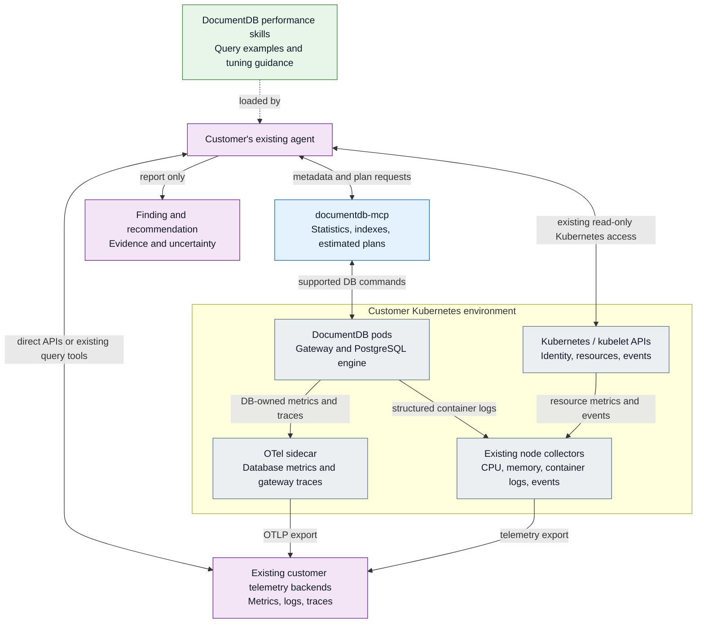
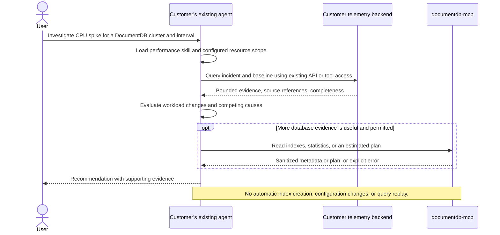

# DocumentDB performance advisor design

**Status:** Draft for review, revised September 14, 2026.

## Terminology

- **DocumentDB cluster:** A `DocumentDB` resource and its PostgreSQL and gateway pods.
- **Kubernetes cluster:** The infrastructure hosting the operator and DocumentDB workloads.
- **Query family:** Requests with the same normalized query structure, with literal values removed.

## Problem statement

Investigating a performance regression requires comparing resource usage, request activity, database execution evidence, and Kubernetes changes. These signals can live in different systems and use different identifiers. A CPU spike alone does not identify the expensive query or the appropriate tuning action.

Build an optional performance-advisor integration that lets a customer's existing agent investigate DocumentDB Kubernetes workloads using metrics, logs, traces, and narrowly authorized database diagnostics. The initial scenario is investigating a CPU spike, identifying likely contributing query families, and recommending an evidence-backed next step.

Package investigation playbooks, version-aware tuning guidance, query examples, and setup instructions for the customer's existing agent.

Reuse `microsoft/documentdb-mcp` for database diagnostics. For telemetry, the agent can use its existing backend API access, CLI/SDK query tools, or MCP integrations. Add code only for a specific missing capability, such as a DocumentDB diagnostic or a calculation that existing query tools cannot provide.

## Goals

- Correlate resource changes with workload activity at the appropriate DocumentDB cluster, pod, container, operation, and query-family scope.
- Distinguish increased traffic from increased work per operation, gateway contention, resource throttling, and database maintenance.
- Produce recommendations with evidence, uncertainty, expected tradeoffs, and a proposed verification procedure.
- Operate through read-only, scoped, cost-bounded tools, including when the database is temporarily unavailable.
- Keep the skill pack independent of the customer's model provider and telemetry backend.

## Non-goals

- Automatically creating indexes, changing configuration, scaling DocumentDB clusters, replaying queries, or applying other remediation.
- Installing a mandatory telemetry storage stack or retaining a separate copy of the customer's complete telemetry.
- Providing exact per-query CPU attribution using elapsed time or timestamp correlation alone.

## Current capabilities and gaps

The following is a source-level baseline reviewed on September 13, 2026, not a guarantee about any deployed image.

| Surface | Existing capability to reuse | Gap for this project |
|---|---|---|
| DocumentDB gateway | Operation counts, latency histograms, phase timings, and OTel metrics/tracing integration. | Identify the query family and backend execution associated with each request; include trace IDs in related logs. |
| Kubernetes operator monitoring | Opt-in Collector sidecar, a metrics pipeline, PostgreSQL health collection, and exporter configuration. | Export gateway traces and structured logs to the customer's telemetry systems. Add matching Kubernetes cluster, DocumentDB cluster, namespace, pod, and container identifiers to the signals. |
| Platform observability | Customer-selected resource collection and telemetry storage. | Reuse existing CPU/memory collection and backend query access; document which fields identify DocumentDB workloads. |
| `documentdb-mcp` | Connection profiles and tools such as `get_statistics`, `list_indexes`, `explain_operation`, and `current_ops`. | Allow metadata and estimated-plan reads; block writes and unapproved query execution; enforce timeouts, response limits, and redaction. |

Query-level recommendations require query-level evidence. If the deployed stack provides only resource or operation-level metrics, the integration reports that level of detail and identifies missing capabilities instead of inventing query attribution.

## Architecture

### Components and packaging

The direct agent-to-backend edge represents the customer's existing query access. An HTTP/SDK tool, a Grafana query integration, or an existing MCP server can provide that access. The diagram does not require a new telemetry proxy. The collection arrows show how data reaches storage independently of investigations.

| Deliverable | Proposed location and responsibility |
|---|---|
| Performance skill pack | Owned by this repository, alongside its observability guidance and deployment examples, with a versioned distribution consumable by supported agent clients. Include investigation procedures, evidence requirements, tuning references, and limitations. |
| Database diagnostic changes | Contribute upstream to `microsoft/documentdb-mcp`; reuse its connection profiles and database connectivity rather than fork it. |
| Observability integration | Document and reuse the agent's existing authorized backend access. Add an adapter only for a concrete missing query, scope-control, or calculation capability. |
| Optional deployment examples | Supply client configuration and, when a separate tool service is needed, Helm examples for that service. |
| Signal and identity improvements | Operator collection/configuration changes belong in this repository. Gateway and engine changes belong in `documentdb/documentdb`. |

Publish the supported agent clients and query integrations, with setup examples for each.

### Enablement and compatibility

Installation of the skill pack and configuration of the required query access are explicit and opt-in. Existing monitoring controls remain responsible for enabling collection.

The diagnostic permissions allow bounded metadata reads and estimated plans. Changes to data/configuration and replaying application queries require separate authorization. A read-only operation can still execute substantial work or reveal customer data.

Any gateway or backend instrumentation requiring a new feature flag must be designed in its owning repository and covered by enabled/disabled tests. Sensitive query capture and expensive profiling require separate configuration and review.

Monitoring API changes follow the operator's API review and image-compatibility process. Publish a compatibility matrix covering operator, gateway, engine, MCP server, and query-integration versions. Unsupported diagnostics must produce explicit capability errors rather than trigger a more expensive fallback.

### Telemetry export and matching fields

The operator work consists of concrete collection changes:

1. Configure the gateway and OTel sidecar to send request traces to the customer's trace destination.
2. Send structured gateway/database logs through the existing node log collector, or through OTLP when the application already emits OTLP logs.
3. Attach matching Kubernetes cluster, DocumentDB cluster, namespace, pod UID, and container fields to metrics, logs, and traces. Include trace/span IDs in request-related logs so an investigation can follow one operation across signals.

For example, a CPU series for a particular PostgreSQL pod can be compared with request activity on that same pod and interval. Trace IDs then connect individual operations to related logs. These fields enable joins; they do not by themselves attribute CPU consumption to a query.

The existing Kubernetes node collectors continue collecting container CPU, memory, and node information. The database sidecar handles database/application telemetry.

### Existing backend access and Grafana

If your agent already queries your telemetry backend, use that access. An MCP integration is one way to make the same query operations available to an agent, not a requirement to introduce another service. The selected access path must enforce the required credentials, resource scope, and query limits.

Grafana queries configured data sources and presents the results in dashboards and Explore. The underlying systems store the metric, log, and trace data:

| Component | Role |
|---|---|
| Grafana | Dashboards, exploration, and data-source query APIs. |
| Prometheus, Mimir, or another metrics backend | Store and query metric time series. Prometheus is one option, not a required dependency of Grafana. |
| Loki, Tempo, or other log/trace backends | Store and query the corresponding signals. |

Grafana Cloud also provides managed storage behind its data sources. Customers using it may already have all the storage needed for this integration.

When Grafana is already available, reuse its data-source APIs or an existing Grafana MCP integration. Otherwise, query the existing backends directly. Choose a reference deployment from the systems already used by the target customers rather than requiring a new Prometheus/Loki/Tempo installation.

### Database and telemetry tool boundaries

The existing database tool registry wraps handlers in `withDbGuard`, resolving a database profile and opening a database connection. Historical telemetry queries must not depend on that path. A database outage should produce an explicit diagnostic failure while leaving the telemetry investigation available.

Database diagnostics use an administrator-configured profile, never a model-supplied connection string or arbitrary endpoint. Configuration maps that profile to the corresponding Kubernetes cluster, DocumentDB resource UID, namespace, and database/collection scope. Existing backend credentials and permissions must enforce the authorized scope; a query filter or a skill instruction is not an access-control boundary.

Database diagnostics must control mutations, execution cost, and data disclosure. For `documentdb-mcp`, the initial upstream work is:

- Add an estimated-plan mode that returns the selected execution plan without running the query, or provide a dedicated tool for that operation. Preserve existing tool contracts unless intentionally versioned. Until this mode exists, do not automatically invoke the current `explain_operation`, which requests execution statistics.
- Separate authorized live-operation diagnostics from general management capability. Do not enable destructive management tools merely to access `current_ops`.
- Minimize and redact results before they reach the agent. Collection documents, query literals, credentials, and unrestricted log content are not default evidence.
- Apply backend-side permissions, timeouts, bounded result sizes, and an explicit tool allowlist. A tool must be unavailable when its underlying command cannot enforce the requested scope.
- Publish capability and version information so the skill can distinguish unsupported diagnostics from an empty result.

Do not silently replace missing diagnostics with unrestricted SQL, shell access, document scans, or a broader database profile.

#### PostgreSQL-specific evidence

The database MCP uses the wire-protocol driver. If PostgreSQL-specific statistics are needed, obtain them through supported diagnostic APIs or an existing collector with a scoped, read-only identity.

Where `pg_stat_statements` is enabled, validate how SQL query IDs map to document-query families. Wrapped document commands must not be assumed to have a one-to-one query-shape mapping. Missing statistics, resets, or unsupported configuration are surfaced as evidence limitations.

Any new engine diagnostic API or explain-output change needs its own version/upgrade handling and supported PostgreSQL-version coverage.

### Evidence and correlation requirements

The skill specifies what evidence an investigation needs and how to interpret it. Retrieve that evidence through existing APIs/tools where possible. The operations below describe investigation needs, not a requirement for new MCP tools or a new response format from every backend.

| Logical operation | Result and constraints |
|---|---|
| Resolve scope and capabilities | Trusted profile-to-resource mapping, allowed databases/collections, server versions, available signals, and supported diagnostic modes. |
| Get resource and workload window | Bounded incident and baseline windows, resource usage, operation counts, duration distributions, and source coverage. |
| Get top query shapes | Ranked changes in count and elapsed work from windowed query statistics, only when supported. Return omitted/truncated coverage explicitly. |
| Get query evidence | Representative traces/logs and available execution or plan evidence for a scoped query family and interval. |
| Read database metadata | Current statistics/index metadata or approved plan diagnostics, labeled with observation time and applicable versions. |

Keep the applicable information below alongside the retrieved data in the investigation record. Obtain it from query context, existing responses, and configured resource mappings. Mark unavailable information explicitly; resource-only evidence must not fabricate a query identity.

| Field group | Required meaning |
|---|---|
| Schema and source | Investigation-record version, backend/tool identity, source references, retrieval time, and version information. |
| Scope | Trusted profile ID, Kubernetes cluster identity, DocumentDB resource UID, namespace, and applicable database/collection restrictions. |
| Resource | Pod UID, container, instance/role, and actual resource limits where available. Names alone are not lifetime-stable identifiers. |
| Time | UTC interval with an explicit start and exclusive end, aggregation resolution, and observation/capture timestamps. |
| Measurements | Units, counter temporality/reset handling, aggregation method, and measured values. Missing data is not zero. |
| Query identity | Operation, normalized query-shape fingerprint and fingerprint version, plus plan identity where available. |
| Execution identity | Trace/span IDs and the actual backend pod/session/execution mapping where available. |
| Coverage | Sampling policy, sample counts where available, retention gaps, source availability, and truncation. |
| Outcome | Explicit success, partial evidence, or typed failure. Preserve valid partial evidence without disguising failed subqueries. |

#### Query-shape identity

The normalized query shape removes literals while preserving semantic structure, value types, pipeline order, sort-key order, and relevant options. It is not the raw request hash and is not a guarantee of identical selectivity or cost. A fingerprint is also not an anonymization guarantee.

Preserve array-matching semantics, nested paths, `$elemMatch` boundaries, and the distinction between one array element satisfying multiple predicates and different elements satisfying them independently.

Do not reorder pipeline stages, sort keys, or document structures whose ordering is semantically significant. Array cardinality and literal selectivity may affect cost even within one shape. Unsupported or over-budget normalization produces an explicit unavailable shape, not an incorrectly merged identity.

#### Request identity and sampling

The gateway must retain the operation-to-backend association across pooled connections, retries, and cursor continuation. Connection identity alone is not request identity. If no incoming trace context is available, locally generated request tracing can still support investigation.

Keep request-count and duration aggregates independent of trace sampling. Tail-sampled slow traces are useful examples, not an unbiased population. Use exemplars to navigate from a measurement to a trace, not as proof of CPU ownership. Avoid counting a request span and its nested phase spans twice.

Current metadata is not automatically historical evidence. For example, an index list or estimated plan fetched after an incident cannot prove which plan ran during the incident. Capture timestamps and state changes must be reflected in the report.

#### Instance and replica attribution

For primary/read-replica configurations, analyze each actual serving instance and role before aggregating compatible measurements. Failover, pod recreation, role changes, and similarly named collections in different namespaces must not mix evidence.

Merge histogram buckets or supported distributions correctly; do not average percentile values across pods. Preserve retries and continuation links without counting one logical operation as unrelated successful work.

Future sharded topologies need explicit shard and routing identity before the integration can claim shard-level attribution.

### CPU-spike investigation

The investigation follows these evidence requirements:

1. Identify whether the spike belongs to PostgreSQL, the gateway, or another container. Compare actual limits and throttling signals when available, not only the declared DocumentDB cluster resource envelope.
2. Select a comparable baseline and account for resource changes, restarts, failovers, and counter resets. Separate request-rate growth from growth in work per request.
3. Rank scoped query-family changes using deterministic backend queries or adapter calculations. Prefer phase-specific evidence over summed nested spans.
4. Retrieve representative execution evidence and applicable metadata. Consider competing causes such as index builds, checkpoints, background maintenance, pool contention, lock waits, or I/O.
5. Produce a supported recommendation or state that the evidence is insufficient. Missing throttling or wait telemetry cannot be used to rule those causes out.

Elapsed time is not CPU consumption. Gateway spans and `pg_stat_statements.total_exec_time` do not provide exact per-query CPU accounting. Direct attribution would require separately designed backend accounting or profiling, including parallel workers and execution identity; that is outside the initial release.

## Recommendations

A report separates deterministic observations from agent-generated hypotheses and recommendations. It includes the authorized target, incident and baseline windows, evidence references, confidence with its rationale, missing evidence, and the versions to which the recommendation applies.

A proposed change must explain its tradeoffs, verification procedure, and rollback prerequisites. Examples include evaluating an index, changing a query shape, adjusting concurrency, or considering additional capacity. Do not promise a numerical improvement without measurement or recommend unsupported database settings or storage-table DDL.

Use existing index definitions and captured or approved estimated plans to evaluate access-path hypotheses. Account for write amplification, storage, index-build cost, selectivity, and the deployed version's support for array paths and compound indexes.

Index suggestions require applicable query and plan evidence, not CPU utilization alone. When literals are unavailable, do not reconstruct a supposedly equivalent query from the normalized shape and claim its plan is authoritative.

You approve and apply any change through supported database or operator interfaces. Reconsider recommendations after relevant workload, index, configuration, or version changes. No report implicitly grants execution permission.

## Resource budgets

Limit telemetry work by authorized scope, bounded windows, backend query timeouts, aggregation resolution, and cardinality. A returned-row limit does not by itself bound scan cost.

Perform time-window selection, aggregation, and top-K filtering in the telemetry backend where possible. Transfer bounded evidence rather than an unfiltered stream of samples, logs, or spans to the model.

The following are proposed starting limits to validate before preview, not measured guarantees or existing configuration fields:

| Limit | Initial proposal |
|---|---|
| Incident and baseline windows | Default 15 minutes each; maximum 60 minutes each. Larger investigations require an explicit deployment-policy change. |
| Ranked query families | At most 20 per response, with truncation/omitted coverage reported. |
| Representative evidence | At most 20 traces and 50 redacted log records per evidence request. |
| Serialized tool response | At most 128 KiB, including references and coverage metadata. |
| Backend query deadline | 10 seconds for a telemetry request and 3 seconds for an individual live database diagnostic, where the backend can enforce cancellation. |
| Live diagnostic concurrency | At most two calls per profile per tool-service instance. Document aggregate limits when deploying multiple instances. |

Client-side timeout alone does not bound work still running in the backend. Do not expose a live diagnostic under the advisor policy if the implementation cannot bound or cancel that work. Retries must not multiply abandoned operations.

Bound collection-side normalization and aggregation state as well as query-time responses. Query fingerprints and trace IDs must not become unrestricted metric labels. If a bounded statistics implementation evicts query families, report that coverage loss.

Any additional tool service should run separately from the database pods. Diagnostic failures must not interrupt collection or database request handling. Enforce limits through backend settings and the selected query integration; skills alone cannot enforce a global budget across independent systems.

## Alternatives considered

| Alternative | Decision |
|---|---|
| A new general-purpose database MCP server | Reject: duplicates connection profiles and diagnostics already present in `documentdb-mcp`. |
| A mandatory new telemetry MCP service | Reject: the agent may already have the required backend API or tool access. Add an adapter only for an identified gap. |
| All telemetry tools inside the existing database connection guard | Reject: prevents independent investigation of database outages and couples unrelated backend credentials. |
| Only a prompt with unrestricted database and observability tools | Reject for the supported integration: policy, redaction, and cost limits require enforcement outside the model. |
| A new correlation service and telemetry store | Defer: introduce only if shared correlation, caching, or a distinct credential boundary cannot be met by existing backends and small adapters. |

## Test plan

### Component tests

The skill pack introduces no backend execution change. For any accompanying instrumentation or diagnostic API change, add tests in the owning gateway/engine repository:

- Stable, versioned shape identity across literal changes; distinct identity for semantically different operators, pipeline order, sort order, and array matching.
- Correct request/backend association under pooled connections, retries, cursor continuation, cancellation, and parallel execution where supported.
- Counter resets, histogram aggregation, sampling metadata, and bounded-cardinality behavior.
- Supported single-instance and replica topologies; explicit unsupported results for unimplemented distributed/sharded evidence.
- Planner-only diagnostics that do not execute the request, scoped permissions, timeouts, and cancellation.
- Version and enabled/disabled coverage for any separately introduced instrumentation flag or backend API.

Backend execution tests may use controlled explain/execution facilities to establish ground truth. That does not authorize the production advisor to run those operations.

### End-to-end tests

Use a disposable Kubernetes cluster, synthetic data, and reproducible workloads. Reuse environment setup and workload helpers from the [end-to-end suite](../../test/e2e/README.md) and [long-haul testing](long-haul-test-design.md) where applicable. Exercise the packaged skills through the supported client/tool configurations, not only direct adapter unit tests.

| Scenario | Expected result |
|---|---|
| Scan-heavy query regression with complete shape evidence | Identify the injected query family among the top three contributors and cite applicable plan evidence. |
| Increased request volume with stable per-operation work | Identify workload growth rather than inventing an inefficient-query explanation. |
| Gateway pool contention or CPU throttling | Distinguish the constrained component when the required signals are available. |
| Lock/I/O waits or background maintenance | Consider the competing explanation; do not equate elapsed time with CPU ownership. |
| Database unavailable but telemetry retained | Continue the historical investigation and mark live diagnostics unavailable. |
| Agent already has direct backend API access | Complete the investigation using that access without deploying a new telemetry service. |
| Agent uses an existing Grafana/MCP query integration | Retrieve the required evidence through that integration using the same scope and interpretation rules. |
| Missing traces, retention gap, or biased samples | Report partial/insufficient evidence; do not manufacture query-level certainty. |
| Pod restart, failover, counter reset, or duplicated collection names | Preserve resource scope and lifetime; do not join unrelated evidence. |
| Cross-namespace/profile request or raw endpoint injection | Deny before accessing an unauthorized backend or resource. |
| Malicious instructions inside a log or query field | Treat them as data; do not expand permissions, execute commands, or change tools. |
| Mutating command, execution-statistics mode, or excessive diagnostic request | Reject under the advisor policy with an explicit outcome. |
| Tool-service timeout or telemetry-export failure | Preserve serving availability and report the actual failure. |

Use deterministic golden evidence fixtures for calculations and scope handling. Evaluate agent-generated hypotheses separately, recording model/client versions and source evidence. Report reproducibility and unsupported-client behavior rather than assuming every model follows the same playbook.

### Release validation

Before each integration release, verify installation/removal, the compatibility matrix, default-deny tool policy, remote authentication, metadata redaction, evidence-schema compatibility, and one complete CPU-spike investigation.

Older or partially instrumented deployments must degrade to explicit coarse or insufficient evidence. Check that removal of the optional integration leaves database serving and existing telemetry collection intact.

### Performance validation

Compare the same workload, dataset, resource allocation, and image versions with collection disabled/enabled and with/without bounded diagnostic requests. Measure CPU per completed operation, throughput, p95/p99 latency, memory, telemetry volume, and diagnostic load.

Proposed preview targets are no more than a 3% p95 latency increase and 3% throughput decrease for baseline collection, and no more than a 5% CPU-per-completed-operation increase. These are review targets to confirm through repeated measurements, not claimed results. Also demonstrate that cardinality and memory remain bounded under query-shape churn.

Evaluate a human-approved recommendation in a disposable environment using a representative workload. Compare the intended improvement against write cost, storage, errors, and tail latency. Never validate a recommendation by automatically replaying a customer's production query.

## Observability

### Workload signals

Reuse gateway request counts, duration distributions, phase timing, and available engine signals. Keep generic container/node collection platform-owned. Add only missing, explicitly versioned correlation attributes or measurements in the owning component.

Use standard OTel attributes where appropriate, including service/version and database operation context. The project-specific shape and resource-identity contract must be reviewed before emission. `db.query.summary` is a low-cardinality description, not a unique query fingerprint.

For any new diagnostic tool or adapter, operational telemetry should cover request latency, timeouts, cancellations, authorization failures, truncation, unsupported capabilities, and backend availability. Reuse existing operational telemetry for unchanged integrations. Do not place query text, secrets, trace IDs, or unrestricted profile/shape IDs in metric dimensions.

### Backend query examples

Document the query examples, units, aggregation, and scope filters for each supported telemetry integration. Keep provider-specific examples separate from the common investigation procedure and reuse the customer's existing query access.

### Integration health

Tool-service availability, authorization failures, sustained budget exhaustion, and source freshness may be monitored through the customer's existing observability platform. A failed investigation does not imply a database outage.

Collection/export failures remain visible through collector health and backend freshness. Keep collection monitoring independent of diagnostic requests.

## Risks and limitations

Read-only operations can still be expensive or disclose sensitive information. Historical inference depends on the retention, sampling, identity, and timing guarantees of the deployed collection path.

A normalized shape may contain parameter-sensitive workloads with different costs. Current metadata may differ from incident-time state. Absence of a sampled trace, wait, or throttling signal does not prove absence of that condition.

The initial integration does not supply exact per-query CPU attribution, a universal index advisor, automatic remediation, or guaranteed improvement from a recommendation.

### Diagnostic outcomes

Preserve native backend errors when using existing tools. For new diagnostic helpers, use explicit outcomes such as the examples below. Represent failures as tool errors or clearly marked partial evidence, never as successful empty results.

| Code | Example message |
|---|---|
| `SCOPE_DENIED` | The requested resource is not authorized by this profile. |
| `SIGNAL_UNAVAILABLE` | Query-shape evidence is unavailable for the requested interval. |
| `CAPABILITY_UNSUPPORTED` | Planner-only diagnostics are not supported by this server configuration. |
| `BUDGET_EXCEEDED` | The request exceeds the configured time-window or diagnostic budget. |
| `DATA_TRUNCATED` | Evidence is partial because the configured response limit was reached. |
| `DIAGNOSTIC_FAILED` | The live diagnostic did not complete; historical telemetry may still be available. |

Error messages and audit records must not include credentials, unredacted queries, or unrestricted backend responses.

## Rollout

| Phase | Deliverable and exit criterion |
|---|---|
| Design alignment | Assign owners, confirm package placement, identity/scoping, supported clients, backend adapter, and privacy/security requirements. |
| Required signals and diagnostic controls | Land missing instrumentation and upstream diagnostic controls. Demonstrate capability detection, scope enforcement, bounded access, and sufficient evidence for the initial scenario. |
| End-to-end prototype | Run the skill pack against the reference deployment using the customer's agent. Produce an evidence-backed CPU investigation without mutations or unsupported attribution. |
| Opt-in preview | Publish pinned compatibility guidance, installation/removal instructions, limitations, and the evaluated operational/performance budgets. Complete the review gates below. |
| Expansion | Add further tuning playbooks or backend integrations after the initial workflow is reliable, based on demonstrated gaps in the existing tools. |

Rollback removes or disables the optional tool integration and revokes its credentials. It does not require reverting database state because the advisor does not mutate it. Instrumentation changes retain their own independent rollout and rollback controls.

### Privacy and data handling

Review any new shape, trace, log, plan, or diagnostic metadata before preview. Even without a new telemetry store, exposing existing data to an agent can expand its audience and send it to a customer-selected model provider.

Default to metadata and bounded summaries, redact before model access, and exclude literals, document bodies, vector values, credentials, and unneeded identifiers. A query fingerprint alone is not proof of anonymization.

Document customer-controlled model egress, agent transcript retention, source retention, access revocation, and any adapter caching. No new centralized evidence store is part of the initial design; introducing one reopens the privacy review.

### Authentication and authorization

Review remote MCP endpoints, authentication, certificates, secrets, diagnostic permissions, and the database-to-telemetry scope mapping before preview.

The current MCP remote-authentication configuration defaults to Entra, while database connection profiles have their own authentication settings. Decide the supported secure deployment story for Kubernetes users without confusing caller authentication with database authentication. Disabling authentication is not a production substitute for that decision.

Use least-privilege service identities, explicitly configured backend endpoints, restricted network paths, and secret references outside skill files and model context. Prevent model-supplied endpoints, scope escalation, mutating aggregate stages, and diagnostic execution outside policy.

Treat telemetry and tool results as untrusted input to the model. Enforce authorization, read-only behavior, budgets, and redaction in trusted code and backend credentials, not prompts. Pin and review skill/tool artifacts, and audit access without persisting sensitive payloads.

### Documentation and support

Provide support guidance covering installation, profile/scope mapping, supported telemetry backends, required signals, permission failures, missing evidence, query-execution controls, and removal of the integration.

Document the ownership split between the database operator, database MCP, observability platform, and customer's agent. Assign maintainers for installation, telemetry configuration, database diagnostics, and investigation guidance before preview.

## Open questions

- Assign implementation and review owners for the operator, MCP, and gateway/engine contributions.
- Confirm the supported agent-client matrix and initial telemetry access path.
- Choose the supported authentication options for remote MCP deployments, including customers using identity providers other than Entra.
- Review the query-shape contract before implementing or emitting new identifiers.
- Select a reference deployment from the target customers' existing observability systems. A Grafana-based deployment is a useful starting point when Grafana and its data sources are already configured.
- Pin the supported operator, gateway image, engine, MCP server, and query-integration versions. Repository support for a feature is not sufficient evidence that a released image implements it.

## References

- [Monitoring overview](../operator-public-documentation/preview/monitoring/overview.md) and [metrics reference](../operator-public-documentation/preview/monitoring/metrics.md).
- [Operator Collector configuration](../../operator/src/internal/otel/config.go).
- [Telemetry playground](../../documentdb-playground/telemetry/README.md).
- [Operator lifecycle telemetry specification](appinsights-metrics.md).
- [DocumentDB gateway telemetry](https://github.com/documentdb/documentdb/tree/main/pg_documentdb_gw/documentdb_gateway_core/src/telemetry).
- [DocumentDB gateway OTel integration](https://github.com/documentdb/documentdb/tree/main/pg_documentdb_gw/documentdb_gateway_otel).
- [DocumentDB MCP overview and deployment configuration](https://github.com/microsoft/documentdb-mcp).
- [MCP tool registry](https://github.com/microsoft/documentdb-mcp/blob/main/src/tools/registry.ts), [database guard](https://github.com/microsoft/documentdb-mcp/blob/main/src/tools/utils/dbGuard.ts), [document tools](https://github.com/microsoft/documentdb-mcp/blob/main/src/tools/document-tools.ts), and [collection tools](https://github.com/microsoft/documentdb-mcp/blob/main/src/tools/collection-tools.ts).
- [MCP architecture](https://modelcontextprotocol.io/docs/learn/architecture) and [Agent Skills](https://agentskills.io/home).
- [Grafana MCP server](https://github.com/grafana/mcp-grafana) as an existing observability-tool integration option.
- [Grafana data sources](https://grafana.com/docs/grafana/latest/datasources/) and [Grafana Cloud data storage](https://grafana.com/docs/grafana-cloud/learn-and-build/get-started/learn/gs-metrics/).
- [OTel database span conventions](https://opentelemetry.io/docs/specs/semconv/db/database-spans/).
- [PostgreSQL statement statistics](https://www.postgresql.org/docs/18/pgstatstatements.html).

Public repository links describe the reviewed source baseline. The release matrix must identify actual supported artifacts rather than depending on mutable branch contents.
