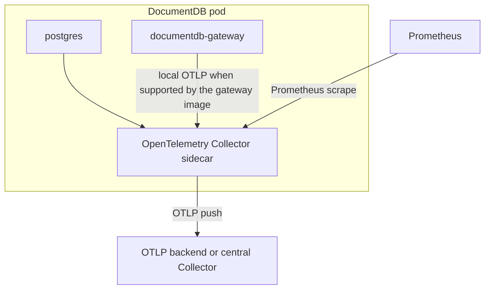

# Monitoring Overview

DocumentDB monitoring is built around an opt-in OpenTelemetry Collector sidecar that the operator injects into each DocumentDB pod. The sidecar collects DocumentDB-owned, pod-local metrics and can export them to an OTLP backend, expose them for Prometheus scraping, or do both.

Pod, container, and node resource metrics are Kubernetes platform metrics, not DocumentDB-specific metrics. Use your platform collector for those signals. If your cluster does not already collect them, the telemetry playground includes a reference kubeletstats DaemonSet you can deploy as an example.

## What the operator owns

The operator-owned monitoring surface is intentionally narrow:

| Area | Responsibility |
|------|----------------|
| Sidecar injection | `spec.monitoring.enabled: true` adds one OTel Collector sidecar to each DocumentDB pod. |
| Exporter routing | `spec.monitoring.exporter` chooses OTLP push, Prometheus pull, or both. |
| DocumentDB-specific metrics | The sidecar emits pod-local metrics such as PostgreSQL health. Gateway application metrics will be documented when a public gateway image emits them. |

The operator chart does not install a node-level collector, a Prometheus stack, Grafana, or vendor dashboards. Those are downstream platform choices.

## Architecture



The sidecar pipeline is an operator implementation detail. Configure the exporter you want; the operator renders the collector configuration needed for that backend.

## Enable monitoring

Set `spec.monitoring.enabled: true` and configure at least one exporter.

### OTLP push

Use OTLP when your metrics backend or central in-cluster Collector accepts OTLP/gRPC.

```yaml
apiVersion: documentdb.io/preview
kind: DocumentDB
metadata:
  name: my-cluster
spec:
  monitoring:
    enabled: true
    exporter:
      otlp:
        endpoint: otel-collector.observability.svc.cluster.local:4317
```

### Prometheus pull

Use the Prometheus exporter when your Prometheus server scrapes pod endpoints. Port `9188` avoids CloudNativePG's instance-manager metrics port (`9187`).

```yaml
apiVersion: documentdb.io/preview
kind: DocumentDB
metadata:
  name: my-cluster
spec:
  monitoring:
    enabled: true
    exporter:
      prometheus:
        port: 9188
```

The operator adds Prometheus scrape annotations to DocumentDB pods when the Prometheus exporter is configured. A pod-annotation scrape job can discover the sidecars:

```yaml
- job_name: documentdb-otel-sidecar
  kubernetes_sd_configs:
    - role: pod
  relabel_configs:
    - source_labels: [__meta_kubernetes_pod_annotation_prometheus_io_scrape]
      action: keep
      regex: "true"
    - source_labels: [__address__, __meta_kubernetes_pod_annotation_prometheus_io_port]
      action: replace
      regex: ([^:]+)(?::\d+)?;(\d+)
      replacement: $1:$2
      target_label: __address__
    - source_labels: [__meta_kubernetes_pod_annotation_prometheus_io_path]
      action: replace
      target_label: __metrics_path__
      regex: (.+)
```

Prometheus Operator users can use an equivalent `PodMonitor` that selects the annotated DocumentDB pods.

### Both exporters

Configure both exporters when you want Prometheus scraping and OTLP push from the same sidecar:

```yaml
apiVersion: documentdb.io/preview
kind: DocumentDB
metadata:
  name: my-cluster
spec:
  monitoring:
    enabled: true
    exporter:
      otlp:
        endpoint: otel-collector.observability.svc.cluster.local:4317
      prometheus:
        port: 9188
```

## Pod and container resource metrics

CPU, memory, network, filesystem, and node metrics are collected from the Kubernetes platform, usually from kubelet, cAdvisor, a managed cloud agent, kube-prometheus-stack, or an OTel Collector DaemonSet. They are useful for operating DocumentDB, but they are not produced by the DocumentDB operator.

If your platform already collects these metrics, filter to DocumentDB pods or containers in that backend. For example, Prometheus metrics produced by an OTel kubeletstats collector commonly use filters like:

```promql
k8s_container_name=~"postgres|documentdb-gateway"
```

If your cluster does not already collect kubelet metrics, see the reference example in [`documentdb-playground/telemetry/container-metrics/`](https://github.com/documentdb/documentdb-kubernetes-operator/tree/main/documentdb-playground/telemetry/container-metrics). Deploying a kubeletstats DaemonSet is a cluster-admin decision because it needs node-level kubelet access and sees pods across namespaces.

## Verify monitoring

First confirm that the DocumentDB pods include the sidecar:

```bash
NS=my-namespace
CLUSTER=my-cluster

kubectl get pods -n "$NS" -l "cnpg.io/cluster=$CLUSTER"
kubectl get pod -n "$NS" -l "cnpg.io/cluster=$CLUSTER" \
  -o jsonpath='{range .items[*]}{.metadata.name}{": "}{range .spec.containers[*]}{.name}{","}{end}{"\n"}{end}'
```

Then verify the backend you configured:

| Exporter | Verification |
|----------|--------------|
| OTLP | Check your central Collector or backend for the `documentdb.postgres.up` metric and the `documentdb.cluster` resource attribute. |
| Prometheus | Query `documentdb_postgres_up` after port-forwarding Prometheus or opening your Prometheus UI. |

If metrics are missing, check:

- `spec.monitoring.enabled: true` is set on the `DocumentDB` resource.
- At least one exporter is configured under `spec.monitoring.exporter`.
- The pods include an `otel-collector` container.
- The sidecar logs do not show exporter connection errors: `kubectl logs <pod> -c otel-collector -n "$NS"`.

## Telemetry playground

The [`documentdb-playground/telemetry/local/`](https://github.com/documentdb/documentdb-kubernetes-operator/tree/main/documentdb-playground/telemetry/local) directory contains a self-contained Kind-based playground. It installs the operator from the local working tree, deploys a DocumentDB cluster with monitoring enabled, applies the reference container-metrics DaemonSet, and provisions Prometheus plus Grafana as one demo stack.

Use the playground when you want a complete local example. Use your platform's existing observability stack for production clusters.

## Next steps

- [Metrics Reference](metrics.md) - DocumentDB-owned metrics and planned metric groups.
