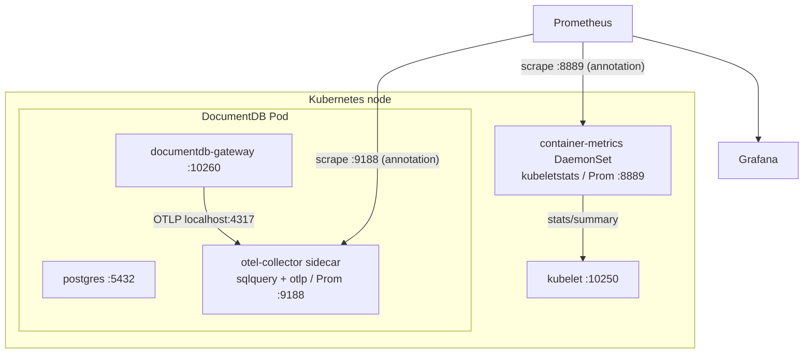

# Monitoring Overview

This guide describes how to monitor DocumentDB clusters running on Kubernetes using the operator's built-in OpenTelemetry Collector sidecar, Prometheus, and Grafana.

## Prerequisites

- A running Kubernetes cluster with the DocumentDB operator installed
- [Helm 3](https://helm.sh/docs/intro/install/) for deploying Prometheus and Grafana
- [kubectl](https://kubernetes.io/docs/tasks/tools/) configured for your cluster
- [`jq`](https://jqlang.github.io/jq/) for processing JSON in verification commands

## Architecture

DocumentDB metrics come from two complementary OTel Collectors:

1. **Per-pod sidecar** (opt-in via `spec.monitoring.enabled: true` on a `DocumentDB`) — runs alongside `postgres` and `documentdb-gateway` in every cluster pod. Collects pod-local signals: Postgres health (`sqlquery` receiver) and gateway-pushed metrics (`otlp` receiver on `127.0.0.1:4317`). No cluster-wide RBAC.
2. **Chart-managed DaemonSet** (opt-in via `--set containerMetrics.enabled=true` at `helm install`) — one OTel Collector per node, scraping its local kubelet's `/stats/summary` for container, pod, and node CPU/memory/network/filesystem metrics.



Key properties:

- **Sidecar holds no cluster-wide privileges.** It only reads pod-local sources; tenant ServiceAccounts are untouched.
- **DaemonSet privilege is held once.** The Helm release installs a single ServiceAccount with `nodes/stats` GET; `helm uninstall` removes it. Per-tenant ClusterRoleBindings are not created.
- **The DaemonSet is the OTel-recommended deployment for the kubeletstats receiver** — see [OpenTelemetry Kubernetes collector components](https://opentelemetry.io/docs/platforms/kubernetes/collector/components/#kubeletstats-receiver). Sidecar deployment of kubeletstats is explicitly not supported by upstream because kubelet's `/stats/summary` cannot be scoped per-caller.
- **Discovery via pod annotations.** Both collectors carry `prometheus.io/scrape=true` annotations so a single annotation-based scrape config picks them both up.

### Enabling the sidecar

```yaml
apiVersion: documentdb.io/preview
kind: DocumentDB
metadata:
  name: my-cluster
spec:
  monitoring:
    enabled: true
    exporter:
      prometheus:
        port: 9188              # avoid CNPG instance manager's 9187
```

### Enabling container/node resource metrics

At chart install or upgrade time:

```bash
helm upgrade --install documentdb-operator <chart> \
  --namespace documentdb-operator \
  --set containerMetrics.enabled=true
```

This is a cluster-admin decision, not a per-DocumentDB toggle: enabling it grants `nodes/stats` to a single chart-managed ServiceAccount, and the DaemonSet exposes container metrics for every pod on each node it lands on.

### Sidecar pipeline

| Stage | Components |
|-------|------------|
| Receivers | `sqlquery` (Postgres health), `otlp` (gateway-pushed metrics on `127.0.0.1:4317`) |
| Processors | `batch`, `resource` (adds `documentdb.cluster`, `k8s.namespace.name`, `k8s.pod.name`) |
| Exporters | `prometheus` on the configured port |

The pipeline is deep-merged from an embedded static config (`base_config.yaml`) and a dynamic config rendered by the operator. ConfigMap content-hashing triggers pod rolls only when the rendered config actually changes.

## Prometheus Integration

### Scraping the in-pod sidecar

The operator sets these annotations on every DocumentDB pod when monitoring is enabled, so a single pod-annotation-based scrape job in Prometheus is sufficient:

```yaml
- job_name: documentdb-otel-sidecar
  kubernetes_sd_configs:
    - role: pod
  relabel_configs:
    - source_labels: [__meta_kubernetes_pod_annotation_prometheus_io_scrape]
      action: keep
      regex: "true"
    - source_labels: [__address__, __meta_kubernetes_pod_annotation_prometheus_io_port]
      action: replace
      regex: ([^:]+)(?::\d+)?;(\d+)
      replacement: $1:$2
      target_label: __address__
    - source_labels: [__meta_kubernetes_pod_annotation_prometheus_io_path]
      action: replace
      target_label: __metrics_path__
      regex: (.+)
```

For Prometheus Operator users, a `PodMonitor` selecting the same labels achieves the equivalent effect.

### Container & node metrics

Container CPU, memory, network, and filesystem metrics are produced by the chart-managed `containerMetrics` DaemonSet (one OTel Collector per node, scraping its local kubelet). Enable with `--set containerMetrics.enabled=true` at chart install/upgrade. The DaemonSet pods carry `prometheus.io/scrape=true` annotations and are discovered by the same pod-annotation scrape config above (or filter to `app.kubernetes.io/component=container-metrics` to give them their own job).

## Key Metrics

### Container & node metrics (chart-managed DaemonSet)

When `containerMetrics.enabled=true`, the DaemonSet emits container/pod/node-level resource metrics:

| Metric | Description |
|--------|-------------|
| `container_cpu_time_seconds_total` | Cumulative container CPU time (counter, seconds) |
| `container_memory_working_set_bytes` | Working-set memory (matches OOM accounting) |
| `container_memory_rss_bytes` | Resident set size |
| `k8s_pod_network_io_bytes_total` | Pod-level network bytes (with `direction` attribute) |
| `container_filesystem_usage_bytes` | Filesystem usage per container |
| `k8s_node_*` | Equivalent metrics aggregated at the node level |

Metric names use OpenTelemetry semantic conventions; the OTel Prometheus exporter converts dots to underscores at scrape time. Filter by `k8s_namespace_name`, `k8s_pod_name`, `k8s_container_name`, `k8s_node_name`.

### Operator metrics

Operator controller-runtime metrics are not yet exposed end-to-end through the operator's Helm chart. Tracking issue forthcoming.

## Telemetry Playground

The [`documentdb-playground/telemetry/local/`](https://github.com/documentdb/documentdb-kubernetes-operator/tree/main/documentdb-playground/telemetry/local) directory contains a self-contained Kind-based reference implementation:

- 3-instance DocumentDB HA cluster (1 primary + 2 streaming replicas) with `spec.monitoring.enabled: true`
- Operator chart installed with `--set containerMetrics.enabled=true` so the DaemonSet collector is deployed
- Prometheus configured with pod-annotation discovery
- Grafana with a pre-built container/pod resource dashboard
- Traffic generator for demo workload
- Operator chart installed **from the local working tree** so in-tree operator changes are exercised

```bash
cd documentdb-playground/telemetry/local
./scripts/deploy.sh
./scripts/validate.sh
```

See its [README](https://github.com/documentdb/documentdb-kubernetes-operator/blob/main/documentdb-playground/telemetry/local/README.md) for full instructions.

## Verification

After deploying the monitoring stack, confirm metrics are flowing:

```bash
NS=documentdb-preview-ns

# 1. Pods are 3/3 (postgres + gateway + otel-collector)
kubectl get pods -n $NS -l cnpg.io/cluster=documentdb-preview

# 2. The otel-collector sidecar exists on each pod
kubectl get pod -n $NS -o jsonpath='{range .items[*]}{.metadata.name}{": "}{range .spec.containers[*]}{.name}{","}{end}{"\n"}{end}'

# 3. Prometheus scrape target is UP (port-forward first)
kubectl port-forward svc/prometheus 9090:9090 -n observability &
curl -s 'http://localhost:9090/api/v1/query?query=up{job="documentdb-otel-sidecar"}' | jq '.data.result'

# 4. Container resource metrics from the DaemonSet are present
curl -s 'http://localhost:9090/api/v1/query?query=container_cpu_time_seconds_total{k8s_namespace_name="documentdb-preview-ns"}' | jq '.data.result | length'
```

If no metrics appear, check:

- `spec.monitoring.enabled: true` is set on the `DocumentDB` resource (for sidecar metrics)
- The chart was installed with `--set containerMetrics.enabled=true` (for container metrics)
- Pods are 3/3; if not, check `kubectl logs deploy/documentdb-operator -n documentdb-operator` and the sidecar-injector logs
- The sidecar is healthy: `kubectl logs <pod> -c otel-collector -n $NS`
- The container-metrics DaemonSet is running: `kubectl get pods -n documentdb-operator -l app.kubernetes.io/component=container-metrics`

## Next Steps

- [Metrics Reference](metrics.md) — detailed metric descriptions and PromQL examples
