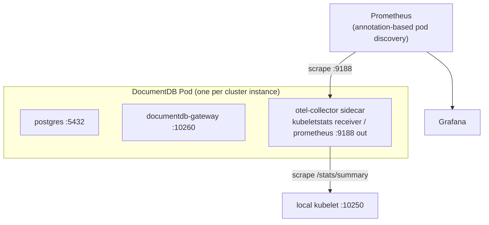

# Monitoring Overview

This guide describes how to monitor DocumentDB clusters running on Kubernetes using the operator's built-in OpenTelemetry Collector sidecar, Prometheus, and Grafana.

## Prerequisites

- A running Kubernetes cluster with the DocumentDB operator installed
- [Helm 3](https://helm.sh/docs/intro/install/) for deploying Prometheus and Grafana
- [kubectl](https://kubernetes.io/docs/tasks/tools/) configured for your cluster
- [`jq`](https://jqlang.github.io/jq/) for processing JSON in verification commands

## Architecture

When `spec.monitoring.enabled: true` is set on a `DocumentDB` resource, the operator instructs the CNPG sidecar-injector plugin to add an **`otel-collector` container to every cluster pod**. The collector exposes a Prometheus `/metrics` endpoint that any scraper (Prometheus, Datadog Agent, Grafana Alloy, …) can consume.



Key points:

- **One collector per pod** — no central Deployment, no per-node DaemonSet. The sidecar's `kubeletstats` receiver scrapes the kubelet on the pod's own node (via the `K8S_NODE_NAME` downward-API env var) and reports container/pod resource metrics for that node.
- **Prometheus discovery via pod annotations** — the injector adds `prometheus.io/scrape=true`, `prometheus.io/port=<port>`, and `prometheus.io/path=/metrics` annotations so a standard pod-annotation scrape config works out of the box.
- **No direct cAdvisor scrape required** — the OTel sidecar's kubeletstats path is the canonical container-metrics source. A direct `/metrics/cadvisor` scrape from Prometheus remains a valid fallback for users without the sidecar enabled.

### Enabling the sidecar with kubeletstats

```yaml
apiVersion: documentdb.io/preview
kind: DocumentDB
metadata:
  name: my-cluster
spec:
  monitoring:
    enabled: true
    kubeletstats: {}              # opt in to container resource metrics via the sidecar
    exporter:
      prometheus:
        port: 9188                # the port the sidecar exposes /metrics on; pick a port distinct from CNPG's instance manager (9187)
```

Once applied, the operator generates the OTel Collector `ConfigMap` and the sidecar-injector adds the `otel-collector` container to every CNPG instance pod. The kubeletstats receiver requires `nodes/stats` permission on the cluster's ServiceAccount — the operator manages a per-cluster `ClusterRoleBinding` to the chart-installed `documentdb-kubeletstats-reader` ClusterRole when `monitoring.kubeletstats` is set.

### Collector pipeline (current)

The collector ships with a minimal pipeline:

| Stage | Components |
|-------|------------|
| Receivers | `kubeletstats` (scrapes the local kubelet on `${K8S_NODE_NAME}:10250` for container/pod resource metrics) and `sqlquery` (a stub `documentdb.postgres.up` query) |
| Processors | `batch`, `resource` (adds `documentdb.cluster`, `k8s.namespace.name`, `k8s.pod.name` to every metric) |
| Exporters | `prometheus` on the configured port (default `8888`; the playground uses `9188` to avoid collision with CNPG's instance manager on `9187`) |

The pipeline is deep-merged from an embedded static config (`base_config.yaml`) and a dynamic config rendered by the operator. Changes to either trigger a content-hash update on the ConfigMap; the sidecar-injector compares hashes and rolls pods only when the config actually changes.

## Prometheus Integration

### Scraping the in-pod sidecar

The operator sets these annotations on every DocumentDB pod when monitoring is enabled, so a single pod-annotation-based scrape job in Prometheus is sufficient:

```yaml
- job_name: documentdb-otel-sidecar
  kubernetes_sd_configs:
    - role: pod
  relabel_configs:
    - source_labels: [__meta_kubernetes_pod_annotation_prometheus_io_scrape]
      action: keep
      regex: "true"
    - source_labels: [__address__, __meta_kubernetes_pod_annotation_prometheus_io_port]
      action: replace
      regex: ([^:]+)(?::\d+)?;(\d+)
      replacement: $1:$2
      target_label: __address__
    - source_labels: [__meta_kubernetes_pod_annotation_prometheus_io_path]
      action: replace
      target_label: __metrics_path__
      regex: (.+)
```

For Prometheus Operator users, a `PodMonitor` selecting the same labels achieves the equivalent effect.

### Container & node metrics

Container CPU, memory, and filesystem metrics are collected by the OTel sidecar's `kubeletstats` receiver and exported to Prometheus alongside any other sidecar metrics. See [Container resource metrics via the OTel sidecar](#container-resource-metrics-via-the-otel-sidecar) below for the receiver configuration and required RBAC.

## Key Metrics

### Container & node metrics (kubeletstats via the OTel sidecar)

When `monitoring.kubeletstats.enabled` is true on the DocumentDB CR, the OTel sidecar runs the `kubeletstats` receiver which scrapes the local kubelet and emits container/pod-level resource metrics:

| Metric | Description |
|--------|-------------|
| `k8s.container.cpu.usage` (`k8s_container_cpu_usage`) | Container CPU usage (cores, gauge) |
| `k8s.container.memory.working_set` (`k8s_container_memory_working_set`) | Working-set memory (matches OOM accounting) |
| `k8s.container.memory.rss` (`k8s_container_memory_rss`) | Resident set size |
| `k8s.pod.network.io` (`k8s_pod_network_io`) | Pod-level network bytes received/transmitted (with `direction` attribute) |
| `k8s.container.filesystem.usage` (`k8s_container_filesystem_usage`) | Filesystem usage per container |

Metric names use OpenTelemetry semantic conventions; the OTel Prometheus exporter converts dots to underscores when scraping. Filter by `k8s_namespace_name`, `k8s_pod_name`, and `k8s_container_name`.

### Operator metrics

Operator controller-runtime metrics are not yet exposed end-to-end through the operator's Helm chart. Tracking issue forthcoming.

## Telemetry Playground

The [`documentdb-playground/telemetry/local/`](https://github.com/documentdb/documentdb-kubernetes-operator/tree/main/documentdb-playground/telemetry/local) directory contains a self-contained Kind-based reference implementation:

- 3-instance DocumentDB HA cluster (1 primary + 2 streaming replicas) with `spec.monitoring.enabled: true` and `monitoring.kubeletstats: {}`
- Prometheus configured with pod-annotation discovery
- Grafana with a pre-built container/pod resource dashboard
- Traffic generator for demo workload
- Operator chart installed **from the local working tree** so in-tree operator changes are exercised

```bash
cd documentdb-playground/telemetry/local
./scripts/deploy.sh
./scripts/validate.sh
```

See its [README](https://github.com/documentdb/documentdb-kubernetes-operator/blob/main/documentdb-playground/telemetry/local/README.md) for full instructions.

## Verification

After deploying the monitoring stack, confirm metrics are flowing:

```bash
NS=documentdb-preview-ns

# 1. Pods are 3/3 (postgres + gateway + otel-collector)
kubectl get pods -n $NS -l app=documentdb-preview

# 2. The otel-collector sidecar exists on each pod
kubectl get pod -n $NS -o jsonpath='{range .items[*]}{.metadata.name}{": "}{range .spec.containers[*]}{.name}{","}{end}{"\n"}{end}'

# 3. Prometheus scrape target is UP (port-forward first)
kubectl port-forward svc/prometheus 9090:9090 -n observability &
curl -s 'http://localhost:9090/api/v1/query?query=up{job="documentdb-otel-sidecar"}' | jq '.data.result'

# 4. Container resource metrics from kubeletstats are present
curl -s 'http://localhost:9090/api/v1/query?query=k8s_container_cpu_usage{k8s_namespace_name="documentdb-preview-ns"}' | jq '.data.result | length'
```

If no metrics appear, check:

- `spec.monitoring.enabled: true` and `spec.monitoring.kubeletstats: {}` are set on the `DocumentDB` resource
- Pods are 3/3; if not, check `kubectl logs deploy/documentdb-operator -n documentdb-operator` and the sidecar-injector logs
- The sidecar is healthy: `kubectl logs <pod> -c otel-collector -n $NS`
- The per-cluster ClusterRoleBinding for `documentdb-kubeletstats-reader` exists: `kubectl get clusterrolebinding | grep kubeletstats`

## Next Steps

- [Metrics Reference](metrics.md) — detailed metric descriptions and PromQL examples
