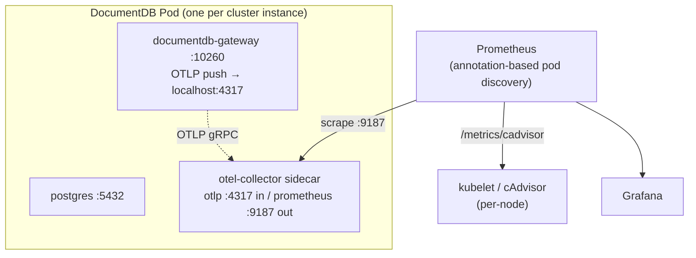

# Monitoring Overview

This guide describes how to monitor DocumentDB clusters running on Kubernetes using the operator's built-in OpenTelemetry Collector sidecar, Prometheus, and Grafana.

## Prerequisites

- A running Kubernetes cluster with the DocumentDB operator installed
- [Helm 3](https://helm.sh/docs/intro/install/) for deploying Prometheus and Grafana
- [kubectl](https://kubernetes.io/docs/tasks/tools/) configured for your cluster
- [`jq`](https://jqlang.github.io/jq/) for processing JSON in verification commands

## Architecture

When `spec.monitoring.enabled: true` is set on a `DocumentDB` resource, the operator instructs the CNPG sidecar-injector plugin to add an **`otel-collector` container to every cluster pod**. The collector runs alongside the `postgres` and `documentdb-gateway` containers and exposes a Prometheus `/metrics` endpoint that any scraper (Prometheus, Datadog Agent, Grafana Alloy, …) can consume.



Key points:

- **One collector per pod** — no central Deployment, no ExternalName bridge, no per-instance Service is required.
- **Gateway → sidecar push** — the sidecar-injector sets `OTEL_EXPORTER_OTLP_ENDPOINT=http://localhost:4317` and `OTEL_RESOURCE_ATTRIBUTES=service.instance.id=$(POD_NAME)` on the gateway container so each pod's metrics are tagged with the originating pod name.
- **Prometheus discovery via pod annotations** — the injector adds `prometheus.io/scrape=true`, `prometheus.io/port=<port>`, and `prometheus.io/path=/metrics` annotations so a standard pod-annotation scrape config works out of the box.
- **Container & node metrics come from kubelet/cAdvisor directly** — Prometheus scrapes them natively; no DaemonSet collector is needed.

### Enabling the sidecar

```yaml
apiVersion: db.microsoft.com/preview
kind: DocumentDB
metadata:
  name: my-cluster
spec:
  monitoring:
    enabled: true
    exporter:
      prometheus:
        port: 9187      # the port the sidecar exposes /metrics on
```

Once applied, the operator generates an `OpenTelemetryConfig` ConfigMap and the sidecar-injector adds the `otel-collector` container to every CNPG instance pod. Pods will be 3/3 (`postgres` + `documentdb-gateway` + `otel-collector`).

### Collector pipeline (current)

The collector ships with a minimal pipeline:

| Stage | Components |
|-------|------------|
| Receivers | `otlp` (gRPC `0.0.0.0:4317`) and `sqlquery` (a stub `documentdb.postgres.up` query) |
| Processors | `batch`, `resource` (adds `service.instance.id`, namespace, cluster, pod metadata) |
| Exporters | `prometheus` on the configured port (default `8888`; the playground uses `9187`) |

The pipeline is deep-merged from an embedded static config (`base_config.yaml`) and a dynamic config rendered by the operator. Changes to either trigger a content-hash update on the ConfigMap; the sidecar-injector compares hashes and rolls pods only when the config actually changes.

### Postgres metrics — deferred

The current pipeline includes only a placeholder `documentdb.postgres.up` SQL query. Comprehensive Postgres metrics (replication lag, backends, commits/rollbacks, WAL age, db size, index stats, etc.) will be added in a follow-up by extending the SQL queries in `operator/src/internal/otel/base_config.yaml`. Until then, dashboards in this repository focus on **gateway metrics** and **container/node metrics**.

## Prometheus Integration

### Scraping the in-pod sidecar

The operator sets these annotations on every DocumentDB pod when monitoring is enabled, so a single pod-annotation-based scrape job in Prometheus is sufficient:

```yaml
- job_name: documentdb-otel-sidecar
  kubernetes_sd_configs:
    - role: pod
  relabel_configs:
    - source_labels: [__meta_kubernetes_pod_annotation_prometheus_io_scrape]
      action: keep
      regex: "true"
    - source_labels: [__address__, __meta_kubernetes_pod_annotation_prometheus_io_port]
      action: replace
      regex: ([^:]+)(?::\d+)?;(\d+)
      replacement: $1:$2
      target_label: __address__
    - source_labels: [__meta_kubernetes_pod_annotation_prometheus_io_path]
      action: replace
      target_label: __metrics_path__
      regex: (.+)
```

For Prometheus Operator users, a `PodMonitor` selecting the same labels achieves the equivalent effect. A reference example will be added in a follow-up.

### Container & node metrics

Use Prometheus's native `kubelet` and `cadvisor` scrape jobs (no collector required):

```yaml
- job_name: kubelet-cadvisor
  kubernetes_sd_configs:
    - role: node
  scheme: https
  tls_config: { insecure_skip_verify: true }
  bearer_token_file: /var/run/secrets/kubernetes.io/serviceaccount/token
  metrics_path: /metrics/cadvisor
  relabel_configs:
    - target_label: __address__
      replacement: kubernetes.default.svc:443
    - source_labels: [__meta_kubernetes_node_name]
      regex: (.+)
      target_label: __metrics_path__
      replacement: /api/v1/nodes/$1/proxy/metrics/cadvisor
```

### Operator metrics

The DocumentDB operator exposes a controller-runtime metrics endpoint. By default:

- **Bind address**: controlled by `--metrics-bind-address` (default `0`, disabled)
- **Secure mode**: `--metrics-secure=true` serves via HTTPS with authn/authz
- **Certificates**: supply `--metrics-cert-path` for custom TLS, otherwise self-signed certs are generated

Enable the endpoint by setting the bind address (e.g. `:8443`) and create a `Service` + `ServiceMonitor` to scrape it.

## Key Metrics

### Gateway application metrics (via OTLP push to the sidecar)

| Metric | Description |
|--------|-------------|
| `db_client_operations_total` | Total MongoDB operations by command type |
| `db_client_operation_duration_seconds_total` | Cumulative operation latency |
| `db_client_request_size_bytes_total` | Cumulative request payload size |
| `db_client_response_size_bytes_total` | Cumulative response payload size |

All gateway metrics carry a `service_instance_id` label set to the originating pod name.

### Container & node metrics (cAdvisor)

| Metric | Description |
|--------|-------------|
| `container_cpu_usage_seconds_total` | Cumulative CPU time consumed (rate it for CPU usage) |
| `container_memory_working_set_bytes` | Working-set memory (matches OOM accounting) |
| `container_memory_rss` | Resident set size |
| `container_network_receive_bytes_total` | Network bytes received (pod-level) |
| `container_network_transmit_bytes_total` | Network bytes transmitted (pod-level) |
| `container_fs_usage_bytes` | Filesystem usage per container |

Filter by `namespace`, `pod`, and `container` labels (e.g. `container="documentdb-gateway"` or `container="postgres"`).

### PostgreSQL metrics

**Deferred** — see [Postgres metrics — deferred](#postgres-metrics--deferred). The CNPG instance manager exposes a separate `/metrics` endpoint that some users may scrape directly; that is independent of the OTel sidecar pipeline.

### Controller-runtime metrics

| Metric | Description |
|--------|-------------|
| `controller_runtime_reconcile_total` | Total reconciliations by controller and result |
| `controller_runtime_reconcile_errors_total` | Total reconciliation errors |
| `controller_runtime_reconcile_time_seconds` | Reconciliation duration histogram |
| `workqueue_depth` | Current depth of the work queue |

## Telemetry Playground

The [`documentdb-playground/telemetry/local/`](https://github.com/documentdb/documentdb-kubernetes-operator/tree/main/documentdb-playground/telemetry/local) directory contains a self-contained Kind-based reference implementation:

- 3-instance DocumentDB HA cluster (1 primary + 2 streaming replicas) with `spec.monitoring.enabled: true`
- Prometheus configured with pod-annotation discovery + native kubelet/cAdvisor scrape
- Grafana with two pre-built dashboards (Gateway, Container & Node Resources)
- Traffic generator for demo workload
- Operator chart installed **from the local working tree** so in-tree operator changes are exercised

```bash
cd documentdb-playground/telemetry/local
./scripts/deploy.sh
./scripts/validate.sh
```

See its [README](https://github.com/documentdb/documentdb-kubernetes-operator/blob/main/documentdb-playground/telemetry/local/README.md) for full instructions.

## Verification

After deploying the monitoring stack, confirm metrics are flowing:

```bash
NS=documentdb-preview-ns

# 1. Pods are 3/3 (postgres + gateway + otel-collector)
kubectl get pods -n $NS -l app=documentdb-preview

# 2. The otel-collector sidecar exists on each pod
kubectl get pod -n $NS -o jsonpath='{range .items[*]}{.metadata.name}{": "}{range .spec.containers[*]}{.name}{","}{end}{"\n"}{end}'

# 3. Prometheus scrape target is UP (port-forward first)
kubectl port-forward svc/prometheus 9090:9090 -n observability &
curl -s 'http://localhost:9090/api/v1/query?query=up{job="documentdb-otel-sidecar"}' | jq '.data.result'

# 4. Gateway metrics are present
curl -s 'http://localhost:9090/api/v1/query?query=db_client_operations_total' | jq '.data.result | length'

# 5. cAdvisor container metrics are present
curl -s 'http://localhost:9090/api/v1/query?query=container_cpu_usage_seconds_total{namespace="documentdb-preview-ns"}' | jq '.data.result | length'
```

If no metrics appear, check:

- `spec.monitoring.enabled: true` is set on the `DocumentDB` resource
- Pods are 3/3; if not, check `kubectl logs deploy/documentdb-operator -n documentdb-operator` and the sidecar-injector logs
- The sidecar is healthy: `kubectl logs <pod> -c otel-collector -n $NS`
- Prometheus has RBAC to read pods, nodes, `nodes/proxy`, and `nodes/metrics`

## Next Steps

- [Metrics Reference](metrics.md) — detailed metric descriptions and PromQL examples
