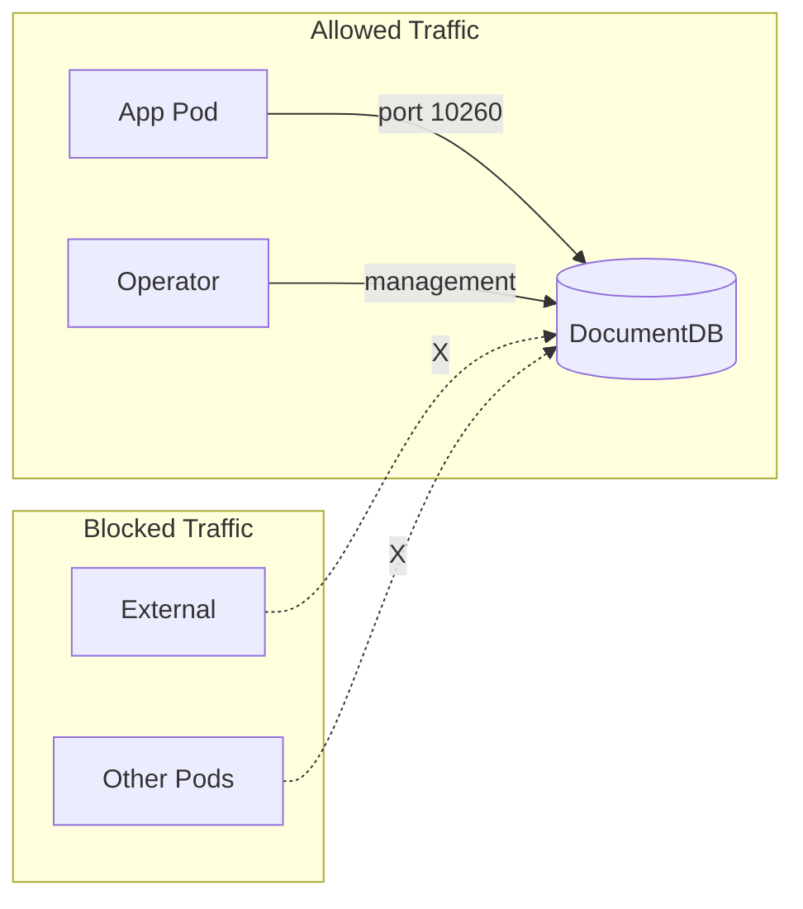

# Network Policies

This guide covers Kubernetes Network Policies for securing DocumentDB deployments. Network policies control traffic flow between pods and external endpoints.

## Overview

By default, Kubernetes allows all pod-to-pod communication. Network policies let you restrict this to only allowed connections.



## Prerequisites

Network policies require a CNI plugin that supports them:

| CNI Plugin | Network Policy Support |
|------------|----------------------|
| Calico | ✅ Full support |
| Cilium | ✅ Full support |
| Azure CNI | ✅ With network policy enabled |
| AWS VPC CNI | ✅ With Calico addon |
| Weave Net | ✅ Full support |
| Flannel | ❌ Not supported |

!!! warning "CNI Compatibility"
    If your CNI doesn't support network policies, the NetworkPolicy resources will be accepted but have no effect.

### Verify Network Policy Support

```bash
# Check if network policy is enabled (AKS example)
az aks show --resource-group <rg> --name <cluster> \
  --query "networkProfile.networkPolicy"

# Test by creating a deny-all policy and verifying it blocks traffic
```

## Basic Network Policy

This policy restricts access to DocumentDB pods to only specific namespaces.

```yaml title="documentdb-network-policy.yaml"
apiVersion: networking.k8s.io/v1
kind: NetworkPolicy
metadata:
  name: documentdb-access
  namespace: documentdb-instance-ns  # (1)!
spec:
  podSelector:
    matchLabels:
      documentdb.io/cluster: my-documentdb  # (2)!
  policyTypes:
    - Ingress
  ingress:
    - from:
        - namespaceSelector:
            matchLabels:
              documentdb-access: "true"  # (3)!
      ports:
        - protocol: TCP
          port: 10260  # (4)!
```

1. Apply in the namespace where DocumentDB is deployed
2. Matches all pods belonging to the DocumentDB cluster
3. Only namespaces with this label can access DocumentDB
4. DocumentDB gateway port

### Apply the Policy

```bash
# Label the application namespace
kubectl label namespace app-namespace documentdb-access=true

# Apply the network policy
kubectl apply -f documentdb-network-policy.yaml
```

## Complete Network Policy Examples

### Allow Specific Applications Only

Restrict access to specific application pods by label:

```yaml title="app-specific-policy.yaml"
apiVersion: networking.k8s.io/v1
kind: NetworkPolicy
metadata:
  name: documentdb-app-access
  namespace: documentdb-instance-ns
spec:
  podSelector:
    matchLabels:
      documentdb.io/cluster: my-documentdb
  policyTypes:
    - Ingress
  ingress:
    # Allow from app pods with specific label
    - from:
        - podSelector:
            matchLabels:
              app: my-backend
          namespaceSelector:
            matchLabels:
              name: app-namespace
      ports:
        - protocol: TCP
          port: 10260
    # Allow operator management traffic
    - from:
        - namespaceSelector:
            matchLabels:
              name: documentdb-operator
      ports:
        - protocol: TCP
          port: 10260
        - protocol: TCP
          port: 5432  # PostgreSQL port for operator
```

### Multi-Tenant Isolation

Isolate DocumentDB instances between teams:

```yaml title="team-isolation-policy.yaml"
apiVersion: networking.k8s.io/v1
kind: NetworkPolicy
metadata:
  name: team-a-documentdb-isolation
  namespace: team-a
spec:
  podSelector:
    matchLabels:
      documentdb.io/cluster: team-a-docdb
  policyTypes:
    - Ingress
    - Egress
  ingress:
    # Only allow from team-a namespace
    - from:
        - namespaceSelector:
            matchLabels:
              team: team-a
      ports:
        - protocol: TCP
          port: 10260
    # Allow operator
    - from:
        - namespaceSelector:
            matchLabels:
              name: documentdb-operator
  egress:
    # Allow DNS resolution
    - to:
        - namespaceSelector: {}
          podSelector:
            matchLabels:
              k8s-app: kube-dns
      ports:
        - protocol: UDP
          port: 53
    # Allow replication between instances (if multi-instance)
    - to:
        - podSelector:
            matchLabels:
              documentdb.io/cluster: team-a-docdb
```

### Allow External LoadBalancer Access

When using LoadBalancer service for external access:

```yaml title="external-access-policy.yaml"
apiVersion: networking.k8s.io/v1
kind: NetworkPolicy
metadata:
  name: documentdb-external-access
  namespace: documentdb-instance-ns
spec:
  podSelector:
    matchLabels:
      documentdb.io/cluster: my-documentdb
  policyTypes:
    - Ingress
  ingress:
    # Allow from internal apps
    - from:
        - namespaceSelector:
            matchLabels:
              documentdb-access: "true"
      ports:
        - protocol: TCP
          port: 10260
    # Allow from LoadBalancer (external traffic)
    # Note: This allows traffic from any source via the LB
    - from: []  # (1)!
      ports:
        - protocol: TCP
          port: 10260
```

1. Empty `from` array allows traffic from any source. Use with caution and ensure authentication is configured.

!!! danger "Security Warning"
    Allowing external access (`from: []`) combined with a public LoadBalancer exposes your database to the internet. Ensure:
    
    - Strong authentication is configured
    - TLS is enabled
    - Consider IP allowlisting at the cloud provider level

## Deny-All Baseline

Start with a deny-all policy and explicitly allow required traffic:

```yaml title="deny-all-baseline.yaml"
apiVersion: networking.k8s.io/v1
kind: NetworkPolicy
metadata:
  name: default-deny-all
  namespace: documentdb-instance-ns
spec:
  podSelector: {}  # Applies to all pods in namespace
  policyTypes:
    - Ingress
    - Egress
```

Then add specific allow policies for DocumentDB traffic.

## Port Reference

DocumentDB uses these ports:

| Port | Protocol | Purpose | Required Access |
|------|----------|---------|-----------------|
| 10260 | TCP | Gateway (MongoDB protocol) | Client applications |
| 5432 | TCP | PostgreSQL | Operator, internal replication |
| 9187 | TCP | Metrics exporter | Prometheus/monitoring |

## Operator Communication

The DocumentDB operator needs to communicate with instance pods. Ensure your network policies allow:

```yaml title="operator-access-policy.yaml"
apiVersion: networking.k8s.io/v1
kind: NetworkPolicy
metadata:
  name: allow-operator-access
  namespace: documentdb-instance-ns
spec:
  podSelector:
    matchLabels:
      documentdb.io/cluster: my-documentdb
  policyTypes:
    - Ingress
  ingress:
    - from:
        - namespaceSelector:
            matchLabels:
              app.kubernetes.io/name: documentdb-operator
        - namespaceSelector:
            matchLabels:
              name: documentdb-operator
      ports:
        - protocol: TCP
          port: 5432
        - protocol: TCP
          port: 10260
```

## Cloud Provider Network Policies

### Azure AKS

Enable network policy when creating the cluster:

```bash
az aks create \
    --resource-group myResourceGroup \
    --name myAKSCluster \
    --network-policy azure  # or calico
```

### AWS EKS

Install Calico for network policy support:

```bash
kubectl apply -f https://raw.githubusercontent.com/aws/amazon-vpc-cni-k8s/master/config/master/calico-operator.yaml
kubectl apply -f https://raw.githubusercontent.com/aws/amazon-vpc-cni-k8s/master/config/master/calico-crs.yaml
```

### GCP GKE

Enable network policy when creating the cluster:

```bash
gcloud container clusters create my-cluster \
    --enable-network-policy
```

## Verifying Network Policies

### Test Policy Enforcement

```bash
# Try to connect from an allowed namespace
kubectl run test-pod --rm -it --image=alpine -n app-namespace -- \
    sh -c "apk add mongodb-tools && mongosh mongodb://my-documentdb:10260"

# Try to connect from a disallowed namespace (should fail)
kubectl run test-pod --rm -it --image=alpine -n default -- \
    sh -c "apk add mongodb-tools && mongosh mongodb://my-documentdb.documentdb-instance-ns:10260"
```

### List Network Policies

```bash
# List all network policies
kubectl get networkpolicies -A

# Describe a specific policy
kubectl describe networkpolicy documentdb-access -n documentdb-instance-ns
```

### Debug Network Policy Issues

```bash
# Check if pods can communicate
kubectl exec -it app-pod -n app-namespace -- \
    nc -zv my-documentdb.documentdb-instance-ns 10260

# Check network policy logs (Calico example)
kubectl logs -n calico-system -l k8s-app=calico-node | grep -i deny
```

## Troubleshooting

### Application Cannot Connect

1. **Verify namespace labels**:
   ```bash
   kubectl get namespace app-namespace --show-labels
   ```

2. **Verify pod labels match policy**:
   ```bash
   kubectl get pods -n documentdb-instance-ns --show-labels
   ```

3. **Check network policy is applied**:
   ```bash
   kubectl get networkpolicy -n documentdb-instance-ns
   ```

### Operator Cannot Manage Instances

Ensure the operator namespace is allowed in your network policy:

```bash
# Label the operator namespace
kubectl label namespace documentdb-operator \
    app.kubernetes.io/name=documentdb-operator
```

### Metrics Collection Fails

Add a rule allowing Prometheus to scrape metrics:

```yaml
ingress:
  - from:
      - namespaceSelector:
          matchLabels:
            name: monitoring
    ports:
      - protocol: TCP
        port: 9187
```

## Best Practices

1. **Start with deny-all** - Create a baseline deny policy, then allow specific traffic
2. **Use namespace selectors** - More maintainable than IP-based rules
3. **Label namespaces consistently** - Use standard labels for policy matching
4. **Test policies in non-production** - Verify policies don't break applications
5. **Document allowed traffic** - Maintain a diagram of allowed communication paths
6. **Monitor for blocked traffic** - Set up alerts for unexpected policy denials

## Next Steps

- [RBAC Configuration](rbac.md) - Configure role-based access control
- [Secrets Management](secrets-management.md) - Manage credentials securely
- [Security Overview](overview.md) - Complete security model
