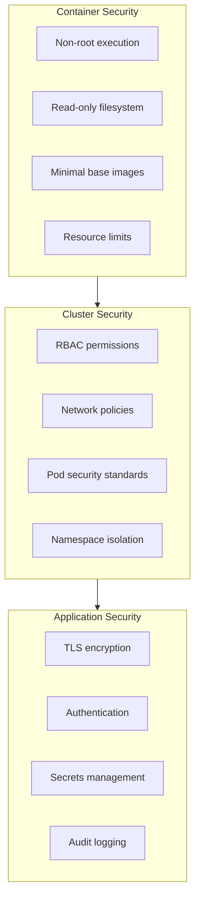

# Security Overview

This guide covers the security model and best practices for DocumentDB deployments on Kubernetes. Security is implemented across multiple layers to provide defense in depth.

## Security Layers

DocumentDB security is organized into three layers:



### Container Security

DocumentDB containers are built with security in mind:

| Feature | Implementation |
|---------|----------------|
| **Non-root execution** | Containers run as non-root user by default |
| **Read-only filesystem** | Root filesystem is read-only where possible |
| **Minimal base images** | Uses distroless or minimal base images |
| **Resource limits** | CPU and memory limits prevent resource exhaustion |
| **No privilege escalation** | `allowPrivilegeEscalation: false` is set |

### Cluster Security

Kubernetes cluster-level security controls:

| Feature | Implementation |
|---------|----------------|
| **RBAC** | Least-privilege ClusterRoles for operator and instances |
| **Network policies** | Restrict pod-to-pod communication |
| **Namespace isolation** | Operator and instances can run in separate namespaces |
| **Service accounts** | Dedicated service accounts per component |

### Application Security

Application-level security features:

| Feature | Implementation |
|---------|----------------|
| **TLS encryption** | All connections encrypted with TLS 1.2+ |
| **Authentication** | Username/password authentication for clients |
| **Secrets management** | Credentials stored in Kubernetes Secrets |
| **Certificate management** | Automatic certificate lifecycle with cert-manager |

## Security Features Summary

### Enabled by Default

These security features are enabled automatically:

- **TLS encryption** - Self-signed certificates generated automatically
- **RBAC** - Operator RBAC rules installed via Helm chart
- **Service accounts** - Per-instance service accounts created automatically
- **Non-root containers** - All containers run as non-root

### Optional Security Features

These features can be enabled for additional security:

| Feature | How to Enable | Documentation |
|---------|---------------|---------------|
| Network policies | Apply NetworkPolicy resources | [Network Policies](network-policies.md) |
| Custom TLS certificates | Configure `spec.tls.mode: Provided` | [TLS Configuration](../advanced-configuration/README.md#tls-configuration) |
| External secrets | Integrate with Key Vault/Vault | [Secrets Management](secrets-management.md) |
| Namespace isolation | Deploy in dedicated namespace | Best practice |

## Shared Responsibility Model

Security is a shared responsibility between the operator and the user:

### Operator Responsibilities

The DocumentDB operator handles:

- Container image security and updates
- Default RBAC configurations
- TLS certificate generation and rotation (when using self-signed or cert-manager modes)
- Secure defaults for pod security context
- Service account creation for instances

### User Responsibilities

Users are responsible for:

- Kubernetes cluster security and hardening
- Network policies to restrict access
- Secrets management and rotation
- Monitoring and alerting
- Backup encryption (when configured)
- Access control for kubectl and API server

## Security Checklist

Use this checklist for production deployments:

### Pre-Deployment

- [ ] Kubernetes cluster is hardened (CIS benchmark)
- [ ] RBAC is enabled on the cluster
- [ ] Network policies are supported (CNI plugin)
- [ ] cert-manager is installed (for TLS)
- [ ] Secrets encryption at rest is enabled

### Deployment

- [ ] Operator installed in dedicated namespace
- [ ] Strong credentials configured in Secret
- [ ] TLS mode configured appropriately
- [ ] Resource limits defined
- [ ] Network policies applied

### Post-Deployment

- [ ] Verify TLS is working (`openssl s_client`)
- [ ] Test network policy enforcement
- [ ] Monitor operator and instance logs
- [ ] Set up alerting for security events
- [ ] Document credential rotation procedures

## Security Hardening Guide

### Level 1: Basic Security (Default)

The default installation provides:

```yaml
apiVersion: documentdb.io/preview
kind: DocumentDB
metadata:
  name: my-documentdb
spec:
  nodeCount: 1
  instancesPerNode: 3
  documentDbCredentialSecret: documentdb-credentials
  # TLS enabled by default (self-signed)
```

### Level 2: Production Security

For production environments, add:

```yaml
apiVersion: documentdb.io/preview
kind: DocumentDB
metadata:
  name: my-documentdb
spec:
  nodeCount: 1
  instancesPerNode: 3
  documentDbCredentialSecret: documentdb-credentials
  tls:
    mode: CertManager  # Use cert-manager for certificate lifecycle
    certManager:
      issuerRef:
        name: letsencrypt-prod
        kind: ClusterIssuer
  resource:
    cpu: "2"
    memory: 4Gi
    storage:
      pvcSize: 100Gi
```

Plus:

- Network policies restricting ingress
- Dedicated namespace with resource quotas
- Monitoring and alerting configured

### Level 3: High Security

For high-security environments, add:

- External secrets management (Azure Key Vault, HashiCorp Vault)
- Mutual TLS (mTLS) for client authentication
- Pod security policies/standards enforcement
- Audit logging enabled
- Intrusion detection monitoring

## Compliance Considerations

DocumentDB on Kubernetes can support various compliance requirements:

| Requirement | How DocumentDB Helps |
|-------------|---------------------|
| **Encryption in transit** | TLS enabled by default |
| **Encryption at rest** | Use encrypted storage classes |
| **Access control** | RBAC and authentication |
| **Audit logging** | Kubernetes audit logs + operator events |
| **Data residency** | Deploy in specific regions/zones |

!!! note "Compliance Certification"
    DocumentDB Kubernetes Operator itself is not certified for specific compliance frameworks. Users must perform their own compliance assessments based on their deployment configuration.

## Next Steps

- [RBAC Configuration](rbac.md) - Configure role-based access control
- [Network Policies](network-policies.md) - Restrict network access
- [Secrets Management](secrets-management.md) - Manage credentials securely
- [TLS Configuration](../advanced-configuration/README.md#tls-configuration) - Configure TLS modes
