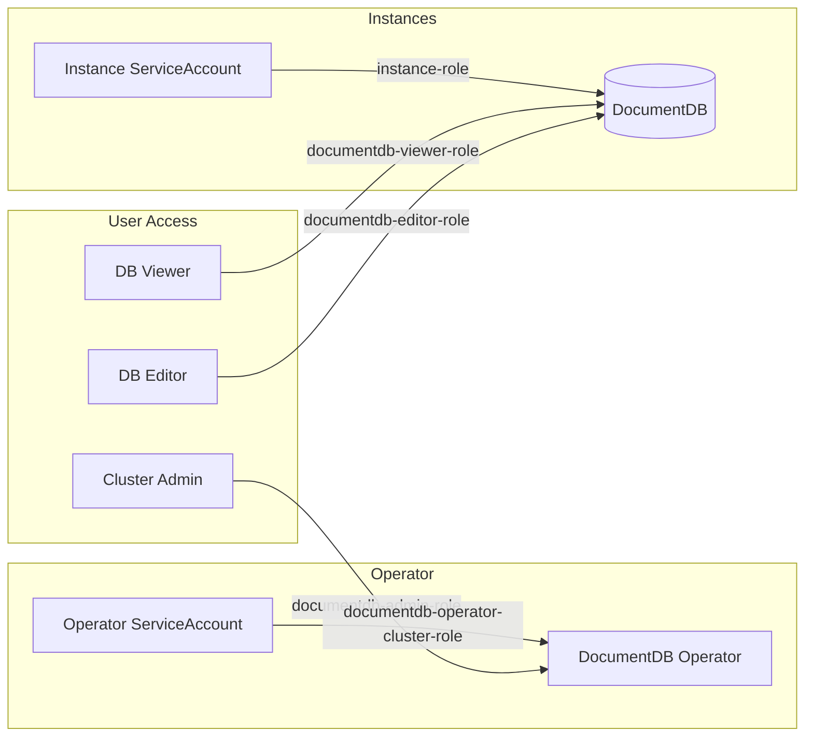
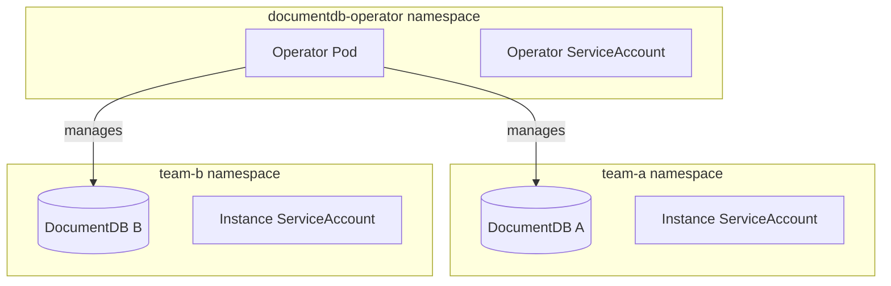

# RBAC Configuration

This guide covers Role-Based Access Control (RBAC) configuration for DocumentDB deployments. The operator uses Kubernetes RBAC to control access to resources.

## Overview

DocumentDB RBAC has three components:

1. **Operator RBAC** - Permissions for the operator to manage resources
2. **Instance RBAC** - Permissions for DocumentDB instance pods
3. **User RBAC** - Permissions for users to manage DocumentDB resources



## Operator RBAC

The operator requires cluster-wide permissions to manage DocumentDB resources across namespaces.

### ClusterRole

The Helm chart creates a ClusterRole with these permissions:

```yaml title="Operator ClusterRole (auto-created by Helm)"
apiVersion: rbac.authorization.k8s.io/v1
kind: ClusterRole
metadata:
  name: documentdb-operator-cluster-role
rules:
  # DocumentDB resource management
  - apiGroups: ["documentdb.io"]
    resources: ["dbs", "dbs/status", "dbs/finalizers"]
    verbs: ["get", "list", "watch", "create", "update", "patch", "delete"]
  
  # Backup resources
  - apiGroups: ["documentdb.io"]
    resources: ["backups", "backups/status", "backups/finalizers"]
    verbs: ["get", "list", "watch", "create", "update", "patch", "delete"]
  
  # ScheduledBackup resources
  - apiGroups: ["documentdb.io"]
    resources: ["scheduledbackups", "scheduledbackups/status", "scheduledbackups/finalizers"]
    verbs: ["get", "list", "watch", "create", "update", "patch", "delete"]
  
  # Kubernetes core resources
  - apiGroups: [""]
    resources: ["services", "pods", "endpoints", "serviceaccounts", 
                "configmaps", "namespaces", "persistentvolumeclaims", "secrets"]
    verbs: ["get", "list", "watch", "create", "update", "patch", "delete"]
  
  # StatefulSets and Deployments
  - apiGroups: ["apps"]
    resources: ["statefulsets", "deployments"]
    verbs: ["get", "list", "watch", "create", "update", "patch", "delete"]
  
  # RBAC management for instances
  - apiGroups: ["rbac.authorization.k8s.io"]
    resources: ["roles", "rolebindings", "clusterrolebindings"]
    verbs: ["get", "list", "watch", "create", "update", "patch", "delete"]
  
  # cert-manager integration
  - apiGroups: ["cert-manager.io"]
    resources: ["certificates", "certificates/status", "issuers", "clusterissuers"]
    verbs: ["get", "list", "watch", "create", "update", "patch"]
  
  # CNPG (underlying PostgreSQL operator)
  - apiGroups: ["postgresql.cnpg.io"]
    resources: ["clusters", "publications", "subscriptions", "clusters/status", 
                "backups", "backups/status"]
    verbs: ["get", "list", "watch", "create", "update", "patch", "delete"]
  
  # Storage management
  - apiGroups: [""]
    resources: ["persistentvolumes"]
    verbs: ["get", "list", "watch", "update", "patch"]
  - apiGroups: ["storage.k8s.io"]
    resources: ["storageclasses"]
    verbs: ["get", "list", "watch"]
  - apiGroups: ["snapshot.storage.k8s.io"]
    resources: ["volumesnapshotclasses"]
    verbs: ["get", "list", "watch", "create", "update", "patch", "delete"]
  
  # Azure Fleet (multi-cluster)
  - apiGroups: ["networking.fleet.azure.com"]
    resources: ["serviceexports", "multiclusterservices", "serviceimports"]
    verbs: ["get", "list", "watch", "create", "update", "patch", "delete"]
```

### ServiceAccount and ClusterRoleBinding

```yaml title="Operator ServiceAccount and Binding (auto-created by Helm)"
apiVersion: v1
kind: ServiceAccount
metadata:
  name: documentdb-operator
  namespace: documentdb-operator
---
apiVersion: rbac.authorization.k8s.io/v1
kind: ClusterRoleBinding
metadata:
  name: documentdb-operator-cluster-rolebinding
subjects:
  - kind: ServiceAccount
    name: documentdb-operator
    namespace: documentdb-operator
roleRef:
  apiGroup: rbac.authorization.k8s.io
  kind: ClusterRole
  name: documentdb-operator-cluster-role
```

### Why Cluster-Wide Permissions?

The operator uses ClusterRole (not Role) because:

1. **Cross-namespace management** - Operator can manage DocumentDB instances in any namespace
2. **Cluster-scoped resources** - PersistentVolumes and StorageClasses are cluster-scoped
3. **Multi-cluster features** - Azure Fleet resources require cluster-wide access
4. **cert-manager integration** - ClusterIssuers are cluster-scoped

## Instance RBAC

Each DocumentDB instance gets its own ServiceAccount, Role, and RoleBinding automatically.

### Auto-Created Instance Resources

When you create a DocumentDB resource, the operator creates:

```yaml title="Instance RBAC (auto-created per instance)"
# ServiceAccount for the instance
apiVersion: v1
kind: ServiceAccount
metadata:
  name: my-documentdb          # Same as DocumentDB name
  namespace: default
---
# Role with minimal permissions
apiVersion: rbac.authorization.k8s.io/v1
kind: Role
metadata:
  name: my-documentdb
  namespace: default
rules:
  - apiGroups: [""]
    resources: ["pods", "services", "endpoints"]
    verbs: ["get", "list", "watch", "create", "update", "patch", "delete"]
---
# RoleBinding connecting ServiceAccount to Role
apiVersion: rbac.authorization.k8s.io/v1
kind: RoleBinding
metadata:
  name: my-documentdb
  namespace: default
subjects:
  - kind: ServiceAccount
    name: my-documentdb
    namespace: default
roleRef:
  apiGroup: rbac.authorization.k8s.io
  kind: Role
  name: my-documentdb
```

Instance RBAC is scoped to the namespace where the DocumentDB is deployed.

## User RBAC Roles

The operator provides pre-defined ClusterRoles for users who need to manage DocumentDB resources.

### documentdb-admin-role

Full permissions over DocumentDB resources. Intended for cluster administrators.

```yaml title="Admin Role (provided in operator/src/config/rbac/)"
apiVersion: rbac.authorization.k8s.io/v1
kind: ClusterRole
metadata:
  name: documentdb-admin-role
rules:
  - apiGroups: ["documentdb.io"]
    resources: ["dbs"]
    verbs: ["*"]
  - apiGroups: ["documentdb.io"]
    resources: ["dbs/status"]
    verbs: ["get"]
```

### documentdb-editor-role

Create, update, and delete permissions. For users who manage DocumentDB instances.

```yaml title="Editor Role (provided in operator/src/config/rbac/)"
apiVersion: rbac.authorization.k8s.io/v1
kind: ClusterRole
metadata:
  name: documentdb-editor-role
rules:
  - apiGroups: ["documentdb.io"]
    resources: ["dbs"]
    verbs: ["create", "delete", "get", "list", "patch", "update", "watch"]
  - apiGroups: ["documentdb.io"]
    resources: ["dbs/status"]
    verbs: ["get"]
```

### documentdb-viewer-role

Read-only access. For users who need visibility without modification permissions.

```yaml title="Viewer Role (provided in operator/src/config/rbac/)"
apiVersion: rbac.authorization.k8s.io/v1
kind: ClusterRole
metadata:
  name: documentdb-viewer-role
rules:
  - apiGroups: ["documentdb.io"]
    resources: ["dbs"]
    verbs: ["get", "list", "watch"]
  - apiGroups: ["documentdb.io"]
    resources: ["dbs/status"]
    verbs: ["get"]
```

### Assigning User Roles

To assign a role to a user or group:

=== "Cluster-wide Access"

    ```yaml title="cluster-rolebinding.yaml"
    apiVersion: rbac.authorization.k8s.io/v1
    kind: ClusterRoleBinding
    metadata:
      name: documentdb-editors
    subjects:
      - kind: User
        name: jane@example.com
        apiGroup: rbac.authorization.k8s.io
      - kind: Group
        name: db-admins
        apiGroup: rbac.authorization.k8s.io
    roleRef:
      apiGroup: rbac.authorization.k8s.io
      kind: ClusterRole
      name: documentdb-editor-role
    ```

=== "Namespace-scoped Access"

    ```yaml title="rolebinding.yaml"
    apiVersion: rbac.authorization.k8s.io/v1
    kind: RoleBinding
    metadata:
      name: documentdb-editors
      namespace: production
    subjects:
      - kind: User
        name: jane@example.com
        apiGroup: rbac.authorization.k8s.io
    roleRef:
      apiGroup: rbac.authorization.k8s.io
      kind: ClusterRole      # Can reference ClusterRole
      name: documentdb-editor-role
    ```

## Namespace Isolation

For multi-tenant environments, isolate DocumentDB instances by namespace.

### Recommended Architecture



### Setup Namespace Isolation

1. **Create team namespaces**:

    ```bash
    kubectl create namespace team-a
    kubectl create namespace team-b
    ```

2. **Apply resource quotas** (optional):

    ```yaml title="resource-quota.yaml"
    apiVersion: v1
    kind: ResourceQuota
    metadata:
      name: documentdb-quota
      namespace: team-a
    spec:
      hard:
        requests.cpu: "8"
        requests.memory: 32Gi
        persistentvolumeclaims: "10"
    ```

3. **Restrict user access by namespace**:

    ```yaml title="team-a-binding.yaml"
    apiVersion: rbac.authorization.k8s.io/v1
    kind: RoleBinding
    metadata:
      name: team-a-documentdb-editors
      namespace: team-a
    subjects:
      - kind: Group
        name: team-a-members
        apiGroup: rbac.authorization.k8s.io
    roleRef:
      apiGroup: rbac.authorization.k8s.io
      kind: ClusterRole
      name: documentdb-editor-role
    ```

## Verifying RBAC

### Check Operator Permissions

```bash
# Verify operator ServiceAccount exists
kubectl get serviceaccount documentdb-operator -n documentdb-operator

# Check ClusterRoleBinding
kubectl get clusterrolebinding documentdb-operator-cluster-rolebinding -o yaml

# Test permissions (as operator ServiceAccount)
kubectl auth can-i create dbs.documentdb.io \
  --as=system:serviceaccount:documentdb-operator:documentdb-operator
```

### Check Instance Permissions

```bash
# List instance ServiceAccounts
kubectl get serviceaccounts -l app.kubernetes.io/managed-by=documentdb-operator

# Check instance Role
kubectl get role my-documentdb -n default -o yaml

# Check instance RoleBinding
kubectl get rolebinding my-documentdb -n default -o yaml
```

### Check User Permissions

```bash
# Test if current user can list DocumentDB resources
kubectl auth can-i list dbs.documentdb.io

# Test if current user can create DocumentDB resources
kubectl auth can-i create dbs.documentdb.io

# Test specific user's permissions
kubectl auth can-i delete dbs.documentdb.io --as=jane@example.com
```

## Troubleshooting RBAC

### Common Issues

**Operator cannot create resources:**

```bash
# Check operator logs for RBAC errors
kubectl logs -n documentdb-operator -l app.kubernetes.io/name=documentdb-operator | grep -i forbidden

# Verify ClusterRole has required permissions
kubectl get clusterrole documentdb-operator-cluster-role -o yaml
```

**User cannot manage DocumentDB:**

```bash
# Check user's effective permissions
kubectl auth can-i --list --as=user@example.com | grep documentdb

# Verify RoleBinding exists
kubectl get rolebindings,clusterrolebindings -A | grep documentdb
```

**Instance pods failing:**

```bash
# Check if ServiceAccount exists
kubectl get serviceaccount my-documentdb -n default

# Check if Role and RoleBinding exist
kubectl get role,rolebinding -n default | grep my-documentdb
```

## Best Practices

1. **Use namespace isolation** - Deploy different teams' instances in separate namespaces
2. **Apply least privilege** - Use viewer role for monitoring, editor for operations
3. **Audit RBAC regularly** - Review who has access to DocumentDB resources
4. **Use groups over users** - Bind roles to groups for easier management
5. **Don't modify operator RBAC** - Changes may break operator functionality

## Next Steps

- [Network Policies](network-policies.md) - Restrict network access
- [Secrets Management](secrets-management.md) - Manage credentials securely
- [Security Overview](overview.md) - Complete security model
