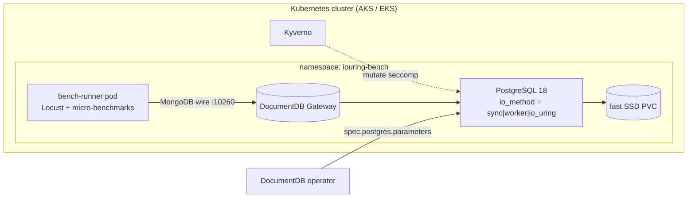

# io_uring Micro-Benchmark Playground

Measure the effect of PostgreSQL 18's asynchronous I/O backends — **`io_method = io_uring`**
vs **`worker`** vs **`sync`** — on a DocumentDB cluster, using the
[`documentdb/micro-benchmarks`](https://github.com/documentdb/micro-benchmarks) Locust
read-query suite.

DocumentDB runs on PostgreSQL 18 (via CloudNative-PG). PG18 introduced a pluggable
asynchronous I/O subsystem; on Linux it can drive reads through **io_uring**, which
batches and overlaps storage I/O to cut latency on scan-heavy read paths (sequential /
bitmap heap scans, `VACUUM`, index builds). This playground turns that knob on a real
DocumentDB cluster and quantifies it.

---

## TL;DR — proven feasibility

A feasibility spike on a local kind cluster (kernel 6.12, `io_uring_disabled=0`) established:

| Finding | Evidence |
|---|---|
| PG18 (`18-minimal-trixie`) ships io_uring support | `initdb` bootstrap postgres attempts `io_uring queue` setup |
| The **only** blocker is container seccomp | With `RuntimeDefault`: `FATAL: could not setup io_uring queue: Operation not permitted` |
| Relaxing seccomp turns it on | With `Unconfined`: PG18.3 starts, `SHOW io_method` → `io_uring`, `pg_stat_io` reads flow |
| Enable path = operator PR #307 | `spec.postgres.parameters.io_method` is passed through to the CNPG Cluster |

So two ingredients are required, and this playground ships both:

1. **`io_method` passthrough** — `spec.postgres.parameters` on the DocumentDB CR (operator PR #307).
2. **Relaxed seccomp** — the DocumentDB CR has no seccomp field and CNPG sets the postgres
   container to `RuntimeDefault`, so we relax it with a **Kyverno mutate policy** (Unconfined
   quick-start, or a hardened Localhost profile installed on the nodes).

> **Where to run for headline numbers:** a managed cloud cluster (AKS/EKS) with a fast
> NVMe / premium-SSD StorageClass. io_uring helps **real** storage I/O — on a laptop kind
> cluster the storage layer is not representative, so treat local runs as smoke tests only.

---

## Architecture



The runner drives the gateway over the MongoDB wire protocol; the operator sets
`io_method` from the CR; Kyverno relaxes seccomp so the io_uring variant can start.

---

## Prerequisites

| Requirement | Notes |
|---|---|
| Kubernetes 1.35+ | DocumentDB operator requires ImageVolume GA |
| Node kernel ≥ 5.1, `io_uring_disabled=0` | Verified by `00-prereqs.sh`; modern AKS/EKS node images qualify |
| Fast StorageClass | NVMe / premium SSD (AKS `managed-csi-premium`, EKS `gp3`/`io2`) for headline numbers |
| DocumentDB operator **with `spec.postgres.parameters`** | i.e. a build that includes operator PR #307 |
| `kubectl`, `helm`, `jq`, `python3` | Local CLIs |

Bring your own cluster, or create one with the sibling playgrounds
[`aks-setup/`](../aks-setup) or [`aws-setup/`](../aws-setup).

---

## Quick start

```bash
cd documentdb-playground/io-uring-benchmark

# 0. Verify tooling + that nodes can run io_uring
./scripts/00-prereqs.sh

# 1. Install cert-manager + the DocumentDB operator (needs the PR #307 build)
./scripts/10-deploy-operator.sh
#    custom image:  OPERATOR_REPO=<repo> OPERATOR_TAG=<tag> ./scripts/10-deploy-operator.sh

# 2. Relax seccomp for io_uring (Kyverno).  unconfined (default) or localhost
./scripts/20-deploy-seccomp.sh
#    hardened:  SECCOMP_MODE=localhost ./scripts/20-deploy-seccomp.sh

# 3. Deploy the DocumentDB cluster (validates io_uring) + the benchmark runner
STORAGE_CLASS=managed-csi-premium ./scripts/30-deploy-documentdb.sh

# 4. Load the dataset once (size it to exceed RAM!)
DOCUMENT_COUNT=10000000 ./scripts/40-load-data.sh

# 5. Run the io_method x workload x selectivity x repeat matrix
./scripts/50-run-matrix.sh

# 6. Pull CSVs out and print the speedup table
./scripts/60-collect.sh

# 7. Tear down
./scripts/99-teardown.sh            # namespace only
./scripts/99-teardown.sh --operator # also remove Kyverno + operator
```

All knobs are environment variables with defaults in [`scripts/lib.sh`](scripts/lib.sh):
`DOCUMENT_COUNT`, `IO_METHODS`, `WORKLOADS`, `SELECTIVITIES`, `REPEATS`, `RUN_TIME`,
`QUERY_USERS`, `IO_WORKERS`, `SECCOMP_MODE`, `STORAGE_CLASS`.

---

## Methodology — making I/O observable

io_uring only helps when reads actually hit **storage**. To get a meaningful signal:

- **Dataset > RAM.** Size `DOCUMENT_COUNT` so the collection comfortably exceeds the pod
  memory limit (`spec.resource.memory`, default `4Gi`) and the OS page cache, forcing reads
  to disk. The default `10,000,000` docs is a starting point — scale it up for larger nodes.
- **One independent variable.** Only `io_method` changes between runs. Image, CPU/memory,
  StorageClass, dataset, and queries are held constant. `50-run-matrix.sh` switches
  `io_method` in place (rolling restart, same PVC/data) so nothing else moves.
- **Repeat and take the median.** `REPEATS` runs per cell; `analyze.py` reports the median
  and the throughput speedup vs the `sync` baseline.
- **Emphasize read-I/O-bound workloads.** `range_scalar` / `range_arr` (large bounded scans)
  and low-selectivity points (large result sets) exercise the heap-read paths io_uring
  accelerates. `index_build` (see below) is another strong signal.
- **Corroborate with the engine.** Each cell snapshots PG18 `pg_stat_io`
  (`*_pg_stat_io.csv`) with `track_io_timing=on`, so you can confirm reads/`read_time`
  actually moved, not just client-side latency.

For strict **cold-cache** numbers, restart the instance (or drop caches on the node)
between cells; the default relies on the dataset exceeding RAM so most reads miss cache.

### Index-build benchmark (optional)

`index_build.py` measures index creation time directly:

```bash
POD=$(kubectl get pod -n iouring-bench -l app=bench-runner -o name | head -1)
kubectl exec -n iouring-bench "$POD" -- bash -lc '
  cd /opt/micro-benchmarks
  URI="mongodb://$MONGO_USERNAME:$MONGO_PASSWORD@$GATEWAY_HOST:$GATEWAY_PORT/?directConnection=true&authMechanism=SCRAM-SHA-256&tls=true&tlsInsecure=true"
  bash test/run_locust.sh --locustfile workloads/read_queries/index_build.py \
    --uri "$URI" --users 1 --run-time 9999s --document-count 10000000 --index-fields=scalar_sel100'
```

Run it once per `io_method` (switch with a `kubectl patch` like `50-run-matrix.sh` does).

---

## Reading the results

`60-collect.sh` copies raw CSVs to `results/raw/` and writes `results/summary.csv` +
`results/summary.txt`. The summary has one row per (workload, selectivity) with each
method's throughput (`rps`) and tail latency (`p95ms`, `p99ms`), plus the speedup of
`worker` and `io_uring` relative to `sync`:

```
workload      selectivity  sync_rps  worker_rps  io_uring_rps  speedup_io_uring_vs_sync
range_scalar  100          102.0     130.0       159.0         1.56x
point_scalar  5k           50.0      —           75.0          1.50x
```

A `speedup_io_uring_vs_sync > 1.0` on the scan-heavy cells is the headline result.
Cross-check against `*_pg_stat_io.csv` to confirm the gain came from faster reads.

---

## File reference

| Path | Purpose |
|---|---|
| `manifests/documentdb-{sync,worker,io_uring}.yaml` | DocumentDB CR variants — differ only in `spec.postgres.parameters.io_method` |
| `manifests/credentials.yaml` | Gateway credentials Secret (replace the password) |
| `manifests/benchmark-runner.yaml` | Long-lived runner pod (clones micro-benchmarks, installs deps) |
| `policy/kyverno-seccomp-unconfined.yaml` | Kyverno mutate → `Unconfined` on CNPG postgres pods (quick start) |
| `policy/kyverno-seccomp-localhost.yaml` | Kyverno mutate → `Localhost profiles/postgres.json` (hardened) |
| `seccomp/io_uring-seccompprofile.json` | Curated profile (CNPG default + io_uring syscalls), from CNPG PR #10446 |
| `seccomp/deploy-seccomp-daemonset.yaml` + `kustomization.yaml` | Installs that profile on every node (`kubectl apply -k seccomp/`) |
| `scripts/00..99-*.sh`, `scripts/lib.sh` | The run pipeline (prereqs → operator → seccomp → deploy → load → run → collect → teardown) |
| `analyze.py` | Builds the median + speedup summary table from Locust CSVs |
| `Dockerfile` | Optional pre-baked runner image |

---

## Why seccomp blocks io_uring (the gory detail)

Modern container runtimes (containerd ≥ ~1.7) **removed** `io_uring_setup`, `io_uring_enter`,
and `io_uring_register` from their default seccomp profile because io_uring has been a
recurring kernel-exploit surface. So a container running with `seccompProfile: RuntimeDefault`
— which is exactly what CloudNative-PG sets on the postgres container — gets `EPERM` the
moment PostgreSQL tries to create its io_uring queue, and crash-loops:

```
FATAL:  could not setup io_uring queue: Operation not permitted
HINT:   Check if io_uring is disabled via /proc/sys/kernel/io_uring_disabled.
```

The fix is to allow those three syscalls again. The **Localhost** profile here does exactly
that and nothing more (preferred); **Unconfined** removes the sandbox entirely (simplest).
Either way, the kernel-level `io_uring_disabled` sysctl must be `0` — `00-prereqs.sh` checks it.

See CloudNative-PG [PR #10446](https://github.com/cloudnative-pg/cloudnative-pg/pull/10446)
for the upstream profile and security discussion.

---

## Related

- [PostgreSQL 18 asynchronous I/O](https://www.postgresql.org/docs/18/runtime-config-resource.html#GUC-IO-METHOD)
- [`documentdb/micro-benchmarks`](https://github.com/documentdb/micro-benchmarks)
- [PostgreSQL parameter tuning on DocumentDB](../../docs/operator-public-documentation/postgresql-tuning.md)
- [CNPG security context / io_uring (PR #10446)](https://github.com/cloudnative-pg/cloudnative-pg/pull/10446)
