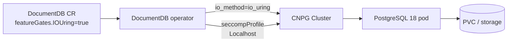

# IOUring Feature Gate Playground

Demonstrate the DocumentDB operator's native `IOUring` feature gate. This is the
supported opt-in path for PostgreSQL 18 `io_method = io_uring` in DocumentDB.

`io_uring` can improve heavy read-I/O paths, but it is also a recurring Linux
kernel exploit surface. Container runtimes therefore remove the
`io_uring_setup`, `io_uring_enter`, and `io_uring_register` syscalls from
`RuntimeDefault` seccomp profiles. The feature is opt-in so clusters keep the
hardened default unless an operator admin deliberately enables it.

When `spec.featureGates.IOUring: true` is set on a `DocumentDB` resource, the
operator does two things:

1. Sets PostgreSQL `io_method=io_uring` on the generated CNPG `Cluster`.
2. Relaxes the postgres pod seccomp profile by pointing it at a **Localhost**
   profile that re-allows only the three io_uring syscalls. The profile path is
   operator-level config (`DOCUMENTDB_IOURING_SECCOMP_PROFILE`, default
   `profiles/documentdb-iouring.json`) and the profile must be installed on the
   nodes.

No Kyverno mutation policy is needed here; the DocumentDB operator owns both the
PostgreSQL parameter and the seccomp wiring.



## Prerequisites

- DocumentDB operator version that includes the native `IOUring` feature gate.
- PostgreSQL 18 image (`ghcr.io/cloudnative-pg/postgresql:18-minimal-trixie` in
  `manifests/documentdb-iouring.yaml`).
- Linux nodes with io_uring enabled (`kernel.io_uring_disabled = 0`, the kernel
  default — `0` means *not disabled*, i.e. enabled):
  ```bash
  kubectl debug node/<node> -it --image=busybox:1.36 -- chroot /host cat /proc/sys/kernel/io_uring_disabled
  ```
- The Localhost profile installed on every node that can run postgres pods at:
  `/var/lib/kubelet/seccomp/profiles/documentdb-iouring.json`.

The operator's built-in default already points at
`profiles/documentdb-iouring.json`, so once that profile is on the nodes you only
need to enable the gate — no operator env config is required.

## Quick start: local kind cluster

Run from this directory so the kind `extraMounts` path resolves to `./seccomp`:

```bash
cd documentdb-playground/io-uring-feature

kind create cluster --config kind/kind-cluster.yaml

# Install cert-manager + the DocumentDB operator per the project docs. No io_uring
# env config is needed: localhost is the only mode and the default profile path
# already matches the mounted profile.

kubectl apply -f manifests/documentdb-iouring.yaml
```

The kind config mounts `./seccomp/documentdb-iouring.json` into each node at the
operator's default Localhost profile path, so the DaemonSet installer is not
needed for kind.

## Quick start: real cluster

```bash
cd documentdb-playground/io-uring-feature

# Install the profile on every node.
kubectl apply -k seccomp/
kubectl rollout status ds/documentdb-iouring-seccomp-installer -n kube-system --timeout=180s

# Install cert-manager + the DocumentDB operator per the project docs. The default
# profile path (profiles/documentdb-iouring.json) matches the installed profile.

kubectl apply -f manifests/documentdb-iouring.yaml
```

To use a different profile path, set it via the first-class Helm value
`--set operator.ioUring.seccompProfile=<path>` on install, or patch an
already-installed operator:

```bash
kubectl patch deployment documentdb-operator -n documentdb-operator \
  --type strategic --patch-file operator-values/seccomp-profile-patch.yaml
kubectl rollout status deployment/documentdb-operator -n documentdb-operator
```

## Verification

Wait for the generated CNPG cluster and primary pod:

```bash
kubectl get documentdb -n iouring-demo iouring-demo
kubectl get cluster.postgresql.cnpg.io -n iouring-demo iouring-demo
kubectl get pods -n iouring-demo -l cnpg.io/cluster=iouring-demo

POD=$(kubectl get pod -n iouring-demo \
  -l cnpg.io/cluster=iouring-demo,cnpg.io/instanceRole=primary \
  -o jsonpath='{.items[0].metadata.name}')
```

Confirm PostgreSQL is using `io_uring`:

```bash
kubectl exec -n iouring-demo "$POD" -c postgres -- \
  psql -U postgres -tAc 'SHOW io_method;'
# expected: io_uring
```

Confirm seccomp was set by the operator:

```bash
kubectl get cluster.postgresql.cnpg.io iouring-demo -n iouring-demo \
  -o jsonpath='{.spec.seccompProfile}{"\n"}'
kubectl get pod -n iouring-demo "$POD" \
  -o jsonpath='{.spec.securityContext.seccompProfile}{"\n"}'
# expected: {"type":"Localhost","localhostProfile":"profiles/documentdb-iouring.json"}
```

Confirm postgres is not crashlooping and `pg_stat_io` reads are visible:

```bash
kubectl get pod -n iouring-demo "$POD" \
  -o jsonpath='{range .status.containerStatuses[*]}{.name}{" restarts="}{.restartCount}{" ready="}{.ready}{"\n"}{end}'

kubectl exec -n iouring-demo "$POD" -c postgres -- psql -U postgres -c \
  "SELECT backend_type, object, context, reads, read_time FROM pg_stat_io WHERE reads > 0 ORDER BY reads DESC LIMIT 10;"
```

## Troubleshooting

| Symptom | Likely cause | Fix |
|---|---|---|
| `FATAL: could not setup io_uring queue: Operation not permitted` | RuntimeDefault still blocks the io_uring syscalls | Ensure `spec.featureGates.IOUring: true` and that the Localhost profile is installed on the node; recreate/restart postgres pods. |
| Same crash, profile installed | Profile missing or wrong path on a node | Verify `/var/lib/kubelet/seccomp/profiles/documentdb-iouring.json` exists on every node, or set `DOCUMENTDB_IOURING_SECCOMP_PROFILE` to the installed relative path. |
| `SHOW io_method;` is not `io_uring` | Feature gate not applied or old operator version | Check `kubectl get documentdb -n iouring-demo iouring-demo -o yaml` and operator logs. |

## File reference

| Path | Purpose |
|---|---|
| `manifests/documentdb-iouring.yaml` | Namespace, demo credentials Secret, and `DocumentDB` CR with `featureGates.IOUring: true`. |
| `seccomp/documentdb-iouring.json` | Curated RuntimeDefault-equivalent profile plus `io_uring_*` syscalls. |
| `seccomp/deploy-seccomp-daemonset.yaml` + `seccomp/kustomization.yaml` | Installs the profile to real cluster nodes. |
| `kind/kind-cluster.yaml` | Local kind cluster config that mounts `./seccomp` into kubelet's Localhost profile directory. |
| `operator-values/seccomp-profile-patch.yaml` | Optional deployment patch to override `DOCUMENTDB_IOURING_SECCOMP_PROFILE`. |
