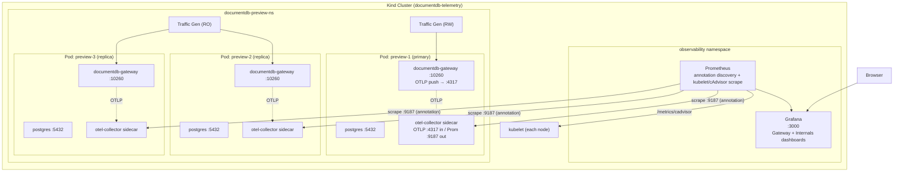

# DocumentDB Telemetry Playground (Local)

A metrics-focused observability stack for DocumentDB running on a local Kind cluster. Deploys a 3-instance HA cluster with the in-pod OTel Collector sidecar enabled and pre-configured Grafana dashboards for **gateway** and **container/node** metrics out of the box.

> **Scope:** This playground covers gateway metrics and VM/container metrics. Postgres-specific metrics (replication lag, backends, WAL age, etc.) are **deferred to a follow-up PR** — they require additional SQL queries in the operator's embedded `base_config.yaml`.

## Prerequisites

- **Docker** (running)
- **kind** ≥ v0.20 — [install](https://kind.sigs.k8s.io/docs/user/quick-start/#installation)
- **kubectl**
- **Helm 3** — [install](https://helm.sh/docs/intro/install/)
- **jq** — for JSON processing in deploy scripts

## Quick Start

```bash
cd documentdb-playground/telemetry/local

# 1. Deploy everything (Kind cluster + operator from this branch + observability + DocumentDB + traffic)
./scripts/deploy.sh

# 2. Open Grafana (admin/admin, anonymous access enabled)
kubectl port-forward svc/grafana 3000:3000 -n observability --context kind-documentdb-telemetry
# → http://localhost:3000  (Dashboards are in the "DocumentDB" folder)

# 3. Open Prometheus (optional)
kubectl port-forward svc/prometheus 9090:9090 -n observability --context kind-documentdb-telemetry
# → http://localhost:9090

# 4. Validate data is flowing
./scripts/validate.sh
```

`deploy.sh` is idempotent — re-running it after a failure will skip already-completed steps.

The operator chart is installed **from this branch** (`operator/documentdb-helm-chart/`), not from the public Helm repo, so any in-tree operator changes (e.g. updates to `base_config.yaml`) are exercised end-to-end.

### What gets deployed

| Component | Namespace | Description |
|-----------|-----------|-------------|
| Kind cluster | — | 4-node cluster (1 control-plane + 3 workers) with local registry |
| cert-manager | `cert-manager` | TLS certificate management |
| DocumentDB operator | `documentdb-operator` | Operator + CNPG (Helm chart from this branch) |
| DocumentDB HA cluster | `documentdb-preview-ns` | 1 primary + 2 streaming replicas |
| OTel Collector sidecar | `documentdb-preview-ns` | One per pod, injected by the operator's CNPG sidecar plugin when `spec.monitoring.enabled=true` |
| Prometheus | `observability` | Metrics storage + alerting rules; scrapes pods via annotation discovery + kubelet/cAdvisor directly |
| Grafana | `observability` | Dashboards (Gateway + Internals) |
| Traffic generators | `documentdb-preview-ns` | Read/write workload via mongosh |

There is **no central OTel Collector Deployment** and **no per-node DaemonSet** — every signal lives in the per-pod sidecar (gateway metrics) or comes straight from kubelet/cAdvisor (container/node metrics).

### Using a custom gateway image

To test a locally built gateway (e.g. with unreleased OTel changes):

```bash
# Push your image to the local Kind registry
docker tag my-gateway:latest localhost:5001/documentdb-gateway:latest
docker push localhost:5001/documentdb-gateway:latest

# Uncomment gatewayImage in cluster.yaml, then deploy
sed -i 's|# gatewayImage:|gatewayImage:|' k8s/documentdb/cluster.yaml
./scripts/deploy.sh
```

## Architecture



## Directory Layout

```
local/
├── scripts/
│   ├── setup-kind.sh          # Creates Kind cluster + local registry
│   ├── deploy.sh              # One-command full deployment
│   ├── validate.sh            # Health check — verifies sidecar + data flow
│   └── teardown.sh            # Deletes cluster and proxy containers
├── k8s/
│   ├── observability/         # Namespace, Prometheus (with annotation discovery + kubelet scrape), Grafana
│   ├── documentdb/            # DocumentDB CR (with spec.monitoring.enabled) + credentials
│   └── traffic/               # Traffic generator services + jobs
└── dashboards/
    ├── gateway.json           # Gateway metrics dashboard
    └── internals.json         # Container & node resources dashboard
```

## Dashboards

Two dashboards are auto-provisioned in the **DocumentDB** folder:

| Dashboard | Description |
|-----------|-------------|
| **Gateway** | Request rates, average latency, error rates, document throughput, request/response sizes, gateway container CPU/memory and pod network I/O |
| **Internals** | Container CPU / memory (working set, RSS) / filesystem usage, pod network rx/tx, node-level memory available, sidecar pod count |

Postgres-internal panels (replication lag, backends, commits/rollbacks, index stats, WAL age) are intentionally absent — they will return in a follow-up PR that extends `operator/src/internal/otel/base_config.yaml` with the corresponding SQL queries.

Dashboards auto-refresh every 30 seconds. Edits made in the Grafana UI persist until the pod restarts.

## Alerting Rules

Prometheus includes sample alerting rules:

| Alert | Condition |
|-------|-----------|
| **GatewayHighErrorRate** | Error rate > 5% for 5 minutes |
| **GatewayDown** | No gateway metrics for 2 minutes |
| **ContainerHighMemory** | Informational — container memory observed |

View firing alerts at `http://localhost:9090/alerts` (after port-forwarding Prometheus).

## Validation

After deployment, verify everything is working:

```bash
./scripts/validate.sh
```

This checks: pods running, the `otel-collector` sidecar is injected on every DocumentDB pod, Prometheus has active targets, the sidecar scrape job is UP, and gateway + cAdvisor metrics are present.

## Restarting Traffic Generators

Traffic generators run as Kubernetes Jobs. To restart them:

```bash
CONTEXT="kind-documentdb-telemetry"
NS="documentdb-preview-ns"

# Delete completed jobs
kubectl delete job traffic-generator-rw traffic-generator-ro -n $NS --context $CONTEXT --ignore-not-found

# Re-apply
kubectl apply -f k8s/traffic/ --context $CONTEXT
```

## Teardown

```bash
./scripts/teardown.sh
```

This deletes the Kind cluster and any proxy containers. The local Docker registry is kept for reuse.

## Troubleshooting

**Gateway metrics missing (`db_client_operations_total` = 0)**

- Check that traffic generators are running: `kubectl get jobs -n documentdb-preview-ns --context kind-documentdb-telemetry`. If completed, restart them (see [Restarting Traffic Generators](#restarting-traffic-generators)).
- Verify the gateway image includes OTel metrics instrumentation. The gateway must be built from a version that includes the OpenTelemetry metrics changes.
- Verify the sidecar is healthy: `kubectl logs documentdb-preview-1 -c otel-collector -n documentdb-preview-ns`. The sidecar should be listening on `0.0.0.0:4317` (gRPC) and serving `/metrics` on the configured Prometheus port.

**OTel sidecar not injected**

- Confirm `spec.monitoring.enabled: true` is set on the `DocumentDB` CR.
- Check the operator logs for the OTel ConfigMap reconciliation: `kubectl logs -n documentdb-operator deploy/documentdb-operator | grep -i otel`.
- Confirm pods have 3/3 containers: `kubectl get pods -n documentdb-preview-ns -l app=documentdb-preview`.

**`deploy.sh` fails at "Installing DocumentDB operator"**

- Ensure Helm chart dependencies can be fetched: `cd operator/documentdb-helm-chart && helm dependency update`.
- Ensure you have internet access for the CNPG Helm dependency.

**Pods stuck in `Pending` or `ImagePullBackOff`**

- Check Docker has enough resources allocated (recommended: 8GB RAM, 4 CPUs).
- Verify the Kind node image exists: `docker images kindest/node:v1.35.0`

