# DocumentDB Telemetry Playground (Local)

A metrics-focused observability stack for DocumentDB on a local Kind cluster. Deploys a 3-instance HA cluster with the in-pod OTel sidecar enabled, a chart-managed container-metrics DaemonSet, and a pre-configured Grafana dashboard for container/pod resource metrics.

## Prerequisites

- **Docker** (running)
- **kind** ≥ v0.20 — [install](https://kind.sigs.k8s.io/docs/user/quick-start/#installation)
- **kubectl**
- **Helm 3** — [install](https://helm.sh/docs/intro/install/)
- **jq** — for JSON processing in deploy scripts

## Quick Start

```bash
cd documentdb-playground/telemetry/local

# 1. Deploy everything (Kind cluster + operator from this branch + observability + DocumentDB + traffic)
./scripts/deploy.sh

# 2. Open Grafana (admin/admin, anonymous access enabled)
kubectl port-forward svc/grafana 3000:3000 -n observability --context kind-documentdb-telemetry
# → http://localhost:3000  (Dashboards are in the "DocumentDB" folder)

# 3. Open Prometheus (optional)
kubectl port-forward svc/prometheus 9090:9090 -n observability --context kind-documentdb-telemetry
# → http://localhost:9090

# 4. Validate data is flowing
./scripts/validate.sh
```

`deploy.sh` is idempotent — re-running it after a failure will skip already-completed steps.

The operator chart is installed **from this branch** (`operator/documentdb-helm-chart/`), not from the public Helm repo. By default `deploy.sh` also **builds and `kind load`s the in-tree operator and sidecar-injector images** so any uncommitted code (e.g. a new `MonitoringSpec` field, a new sidecar env-var) is exercised end-to-end. To skip the local build and pull the chart's default GHCR images instead, set `USE_LOCAL_IMAGES=false`.

### What gets deployed

| Component | Namespace | Description |
|-----------|-----------|-------------|
| Kind cluster | — | 4-node cluster (1 control-plane + 3 workers) with local registry |
| cert-manager | `cert-manager` | TLS certificate management |
| DocumentDB operator | `documentdb-operator` | Operator + CNPG (Helm chart from this branch) |
| DocumentDB HA cluster | `documentdb-preview-ns` | 1 primary + 2 streaming replicas |
| OTel Collector sidecar | `documentdb-preview-ns` | One per pod, injected by the operator's CNPG sidecar plugin when `spec.monitoring.enabled=true`. Receives gateway OTLP metrics and runs the `sqlquery` Postgres-health receiver. |
| Container-metrics DaemonSet | `documentdb-operator` | One OTel Collector per node (chart-managed, gated by `containerMetrics.enabled=true`). Scrapes each node's local kubelet for container/pod/node CPU, memory, network, filesystem metrics. |
| Prometheus | `observability` | Metrics storage + alerting rules; scrapes the per-pod sidecar via annotation discovery |
| Grafana | `observability` | Dashboard (Internals — container/pod resources) |
| Traffic generators | `documentdb-preview-ns` | Read/write workload via mongosh |

There is **no central OTel Collector Deployment**. Per-pod sidecars handle pod-local signals (Postgres health, gateway OTLP); a chart-managed DaemonSet handles node-local kubelet scraping for container resource metrics.

## Architecture

```mermaid
graph TB
    subgraph cluster["Kind Cluster (documentdb-telemetry)"]
        subgraph obs["observability namespace"]
            prometheus["Prometheus<br/>annotation discovery"]
            grafana["Grafana<br/>:3000<br/>Internals dashboard"]
            prometheus --> grafana
        end

        subgraph docdb["documentdb-preview-ns"]
            subgraph pod1["Pod: preview-1 (primary)"]
                pg1["postgres :5432"]
                gw1["documentdb-gateway :10260"]
                otel1["otel-collector sidecar<br/>sqlquery + otlp / Prom :9188"]
            end
            subgraph pod2["Pod: preview-2 (replica)"]
                pg2["postgres :5432"]
                gw2["documentdb-gateway :10260"]
                otel2["otel-collector sidecar"]
            end
            subgraph pod3["Pod: preview-3 (replica)"]
                pg3["postgres :5432"]
                gw3["documentdb-gateway :10260"]
                otel3["otel-collector sidecar"]
            end
            traffic_rw["Traffic Gen (RW)"]
            traffic_ro["Traffic Gen (RO)"]
        end

        kubelet["kubelet :10250 (each node)"]
        ds["container-metrics DaemonSet<br/>kubeletstats / Prom :8889 (per node)"]

        traffic_rw --> gw1
        traffic_ro --> gw2
        traffic_ro --> gw3
        ds -- "stats/summary" --> kubelet
        prometheus -- "scrape :9188 (annotation)" --> otel1
        prometheus -- "scrape :9188 (annotation)" --> otel2
        prometheus -- "scrape :9188 (annotation)" --> otel3
        prometheus -- "scrape :8889 (annotation)" --> ds
    end

    user["Browser"] --> grafana
```



## Directory Layout

```
local/
├── scripts/
│   ├── setup-kind.sh          # Creates Kind cluster + local registry
│   ├── deploy.sh              # One-command full deployment
│   ├── validate.sh            # Health check — verifies sidecar + data flow
│   └── teardown.sh            # Deletes cluster and proxy containers
├── k8s/
│   ├── observability/         # Namespace, Prometheus (annotation discovery), Grafana
│   ├── documentdb/            # DocumentDB CR (with spec.monitoring.enabled) + credentials
│   └── traffic/               # Traffic generator services + jobs
└── dashboards/
    └── internals.json         # Container & pod resources dashboard (DaemonSet kubeletstats)
```

## Dashboards

One dashboard is auto-provisioned in the **DocumentDB** folder:

| Dashboard | Description |
|-----------|-------------|
| **Internals** | Container CPU / memory (working set, RSS), pod network rx/tx, container filesystem usage. Sourced from the chart-managed `containerMetrics` DaemonSet. |

Dashboards auto-refresh every 30 seconds. Edits made in the Grafana UI persist until the pod restarts.

## Alerting Rules

Prometheus includes a sample alerting rule:

| Alert | Condition |
|-------|-----------|
| **ContainerHighMemory** | Container working-set memory > 1Gi for 5 minutes |

View firing alerts at `http://localhost:9090/alerts` (after port-forwarding Prometheus).

## Validation

After deployment, verify everything is working:

```bash
./scripts/validate.sh
```

This checks: pods running, the `otel-collector` sidecar is injected on every DocumentDB pod, Prometheus has active targets, the sidecar scrape job is UP, and container metrics from the DaemonSet are present.

## Restarting Traffic Generators

Traffic generators run as Kubernetes Jobs. To restart them:

```bash
CONTEXT="kind-documentdb-telemetry"
NS="documentdb-preview-ns"

# Delete completed jobs
kubectl delete job traffic-generator-rw traffic-generator-ro -n $NS --context $CONTEXT --ignore-not-found

# Re-apply
kubectl apply -f k8s/traffic/ --context $CONTEXT
```

## Teardown

```bash
./scripts/teardown.sh
```

This deletes the Kind cluster. The local Docker registry is kept for reuse.

## Troubleshooting

**Container metrics missing (`container_cpu_time_seconds_total` empty)**

- Verify the chart was installed with `--set containerMetrics.enabled=true` (the playground does this in `deploy.sh`).
- Check the DaemonSet pods are healthy: `kubectl get pods -n documentdb-operator -l app.kubernetes.io/component=container-metrics`. There should be one per node.
- Check collector logs for kubelet auth issues: `kubectl logs -n documentdb-operator -l app.kubernetes.io/component=container-metrics`.

**OTel sidecar not injected**

- Confirm `spec.monitoring.enabled: true` is set on the `DocumentDB` CR.
- Check the operator logs for the OTel ConfigMap reconciliation: `kubectl logs -n documentdb-operator deploy/documentdb-operator | grep -i otel`.
- Confirm pods have 3/3 containers: `kubectl get pods -n documentdb-preview-ns -l cnpg.io/cluster=documentdb-preview`.

**`deploy.sh` fails at "Installing DocumentDB operator"**

- Ensure Helm chart dependencies can be fetched: `cd operator/documentdb-helm-chart && helm dependency update`.
- Ensure you have internet access for the CNPG Helm dependency.

**Pods stuck in `Pending` or `ImagePullBackOff`**

- Check Docker has enough resources allocated (recommended: 8GB RAM, 4 CPUs).
- Verify the Kind node image exists: `docker images kindest/node:v1.35.0`

